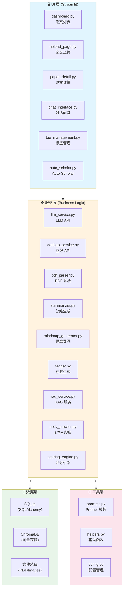
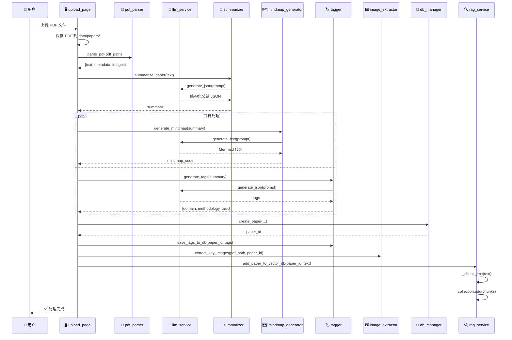
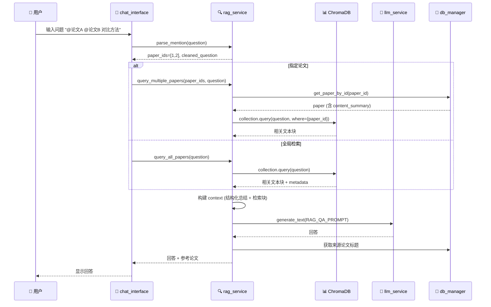
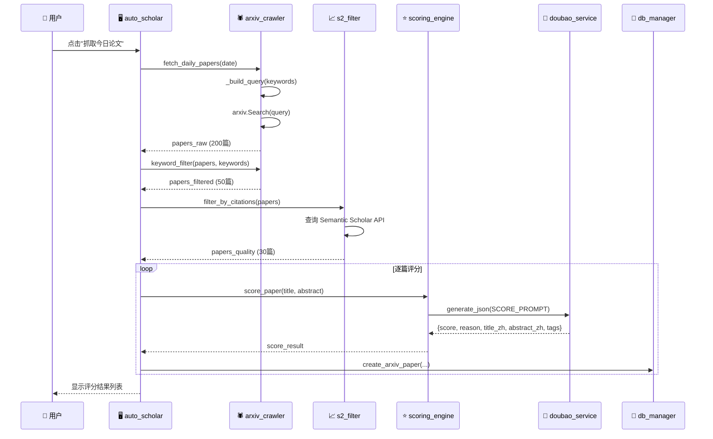
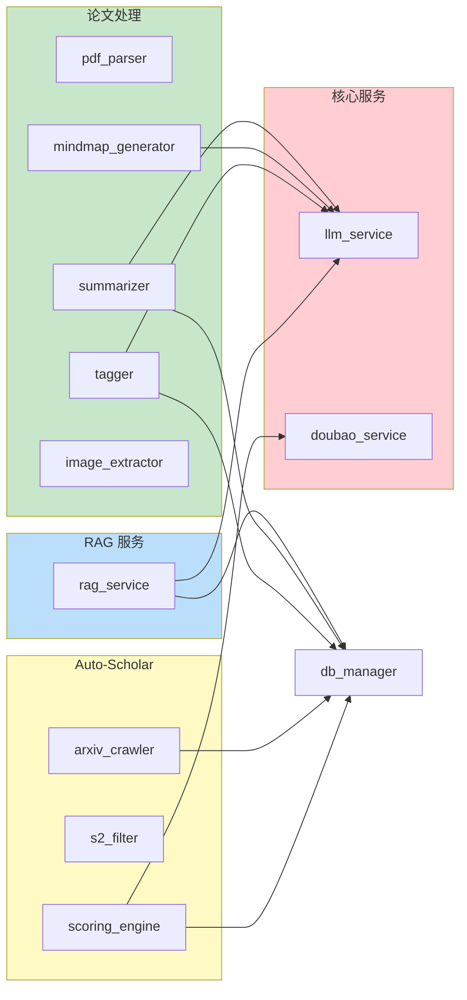
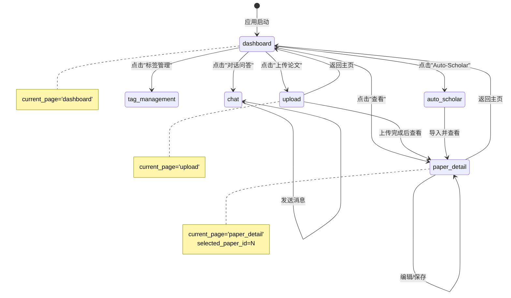
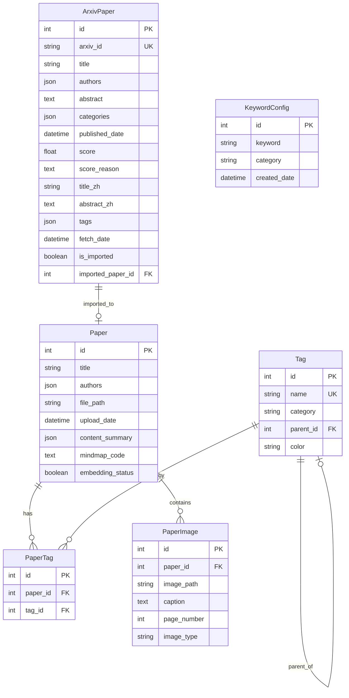
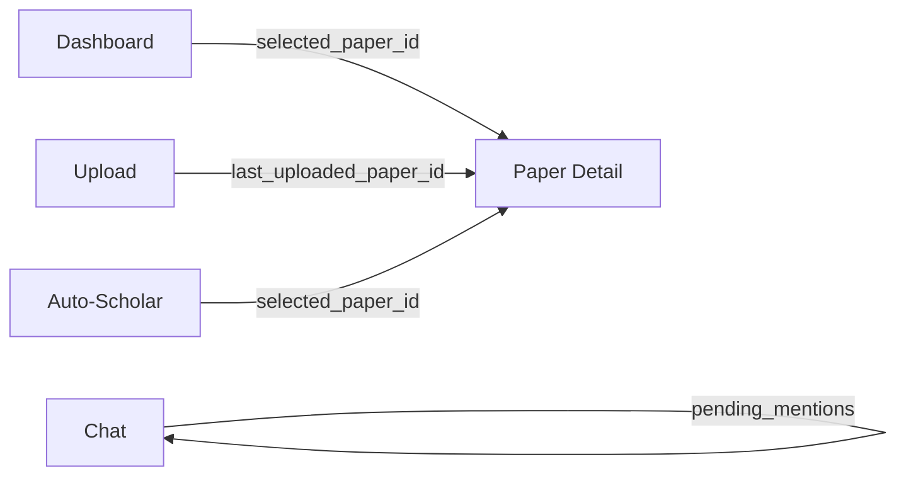
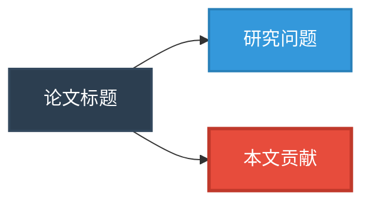

# PaperBrain 技术文档

> **版本**: 1.1.0
> **最后更新**: 2026-02-13
> **文档语言**: 中文

---

## 目录

- [第一部分：项目概述与快速入门](#第一部分项目概述与快速入门)
- [第二部分：系统架构](#第二部分系统架构)
- [第三部分：数据模型](#第三部分数据模型)
- [第四部分：服务层详解](#第四部分服务层详解)
- [第五部分：UI 组件](#第五部分ui-组件)
- [第六部分：Prompt 工程](#第六部分prompt-工程)
- [第七部分：常见问题与最佳实践](#第七部分常见问题与最佳实践)
- [第八部分：API 接口文档](#第八部分api-接口文档)
- [第九部分：扩展与迭代指南](#第九部分扩展与迭代指南)

---

# 第一部分：项目概述与快速入门

## 1.1 项目简介

### 1.1.1 产品定位

**PaperBrain（智能论文笔记助手）** 是一款基于 AI 的学术论文管理系统，旨在帮助研究人员高效管理和理解学术论文。系统通过自动化的论文解析、结构化总结、思维导图生成、智能标签和 RAG（检索增强生成）问答等功能，大幅提升科研工作效率。

### 1.1.2 目标用户

| 用户类型 | 使用场景 |
|---------|---------|
| **科研人员** | 管理大量论文、快速理解论文核心内容、跨论文知识检索 |
| **研究生** | 文献综述、论文阅读笔记整理、研究方向探索 |
| **技术从业者** | 追踪前沿技术、快速了解新算法和方法 |
| **学术团队** | 共享论文库、协作研究、知识沉淀 |

### 1.1.3 核心功能

```
┌─────────────────────────────────────────────────────────────────┐
│                    PaperBrain 核心功能矩阵                        │
├─────────────────────────────────────────────────────────────────┤
│  📄 论文管理        │  🧠 智能分析        │  💬 知识问答          │
│  ├─ PDF 上传存储    │  ├─ 结构化总结      │  ├─ RAG 检索问答     │
│  ├─ 元数据提取      │  ├─ 思维导图生成    │  ├─ @mention 语法    │
│  ├─ 图片提取        │  ├─ 自动标签        │  ├─ 多论文对比       │
│  └─ 标签分类        │  └─ 关键图识别      │  └─ 来源追溯         │
├─────────────────────────────────────────────────────────────────┤
│  🤖 Auto-Scholar（自动学者）                                      │
│  ├─ arXiv 论文爬取                                               │
│  ├─ 关键词筛选                                                   │
│  ├─ LLM 智能评分                                                 │
│  ├─ 论文收藏管理                                                 │
│  └─ 一键导入论文库（✨ v1.1.0 新增）                             │
└─────────────────────────────────────────────────────────────────┘
```

### 1.1.4 功能特性详解

#### 📄 论文管理
- **PDF 上传**: 支持拖拽上传 PDF 格式学术论文
- **自动解析**: 使用 PyMuPDF 提取论文文本、元数据和图片
- **去重检测**: 自动检测同名论文，支持更新而非重复创建
- **文件管理**: 统一存储 PDF 文件和提取的图片

#### 🧠 智能分析
- **结构化总结**: 生成包含 8 个维度的深度论文总结
  - 一句话概括
  - 研究问题定义
  - 相关工作综述
  - 现有方案局限
  - 本文核心贡献
  - 方法论详解
  - 实验结果分析
  - 未来工作展望
- **思维导图**: 自动生成 Mermaid.js 格式的论文思维导图
- **智能标签**: 三维度自动标签（领域/方法/任务）

#### 💬 RAG 问答
- **向量检索**: 基于 ChromaDB 的语义检索
- **@mention 语法**: 支持 `@论文标题` 指定特定论文提问
- **多论文对比**: 支持同时检索多篇论文进行对比分析
- **来源追溯**: 回答附带参考论文来源

#### 🤖 Auto-Scholar
- **arXiv 爬取**: 自动抓取指定领域的最新论文
- **多级筛选**: 关键词匹配 + Semantic Scholar 引用数筛选
- **智能评分**: 基于研究兴趣的 1-10 分评分系统
- **中文翻译**: 自动翻译标题和摘要

---

## 1.2 技术栈总览

### 1.2.1 核心依赖

| 类别 | 技术/库 | 版本 | 用途 |
|-----|--------|------|-----|
| **Web 框架** | Streamlit | 1.31.0 | 前端 UI 和交互 |
| **数据库 ORM** | SQLAlchemy | 2.0.25 | 关系型数据库操作 |
| **向量数据库** | ChromaDB | 0.4.22 | 向量存储和语义检索 |
| **PDF 解析** | PyMuPDF | 1.23.8 | PDF 文本和图片提取 |
| **HTTP 客户端** | Requests | 2.31.0 | API 调用 |
| **环境变量** | python-dotenv | 1.0.0 | 配置管理 |
| **arXiv API** | arxiv | 2.1.0 | 论文元数据爬取 |

### 1.2.2 完整依赖清单

```txt
# requirements.txt
streamlit==1.31.0
sqlalchemy==2.0.25
chromadb==0.4.22
PyMuPDF==1.23.8
requests==2.31.0
python-dotenv==1.0.0
arxiv==2.1.0
streamlit-mermaid==0.0.9
google-generativeai==0.3.2
```

### 1.2.3 技术架构概览

```
┌─────────────────────────────────────────────────────────────────┐
│                         用户界面层                               │
│    Streamlit (dashboard, upload, detail, chat, tags, scholar)   │
├─────────────────────────────────────────────────────────────────┤
│                         服务层                                   │
│  ┌──────────┐ ┌──────────┐ ┌──────────┐ ┌──────────┐           │
│  │ LLM服务  │ │ PDF解析  │ │ RAG服务  │ │ 评分引擎 │           │
│  └──────────┘ └──────────┘ └──────────┘ └──────────┘           │
│  ┌──────────┐ ┌──────────┐ ┌──────────┐ ┌──────────┐           │
│  │ 总结器   │ │ 标签器   │ │ 导图生成 │ │ arXiv爬虫│           │
│  └──────────┘ └──────────┘ └──────────┘ └──────────┘           │
├─────────────────────────────────────────────────────────────────┤
│                         数据层                                   │
│         SQLite (SQLAlchemy)    │    ChromaDB (向量)             │
├─────────────────────────────────────────────────────────────────┤
│                         工具层                                   │
│              Prompts    │    Helpers    │    Config             │
└─────────────────────────────────────────────────────────────────┘
```

---

## 1.3 快速开始

### 1.3.1 环境要求

- **Python**: 3.9+ (推荐 3.10 或 3.11)
- **操作系统**: macOS / Linux / Windows
- **内存**: 建议 8GB+
- **磁盘空间**: 至少 2GB（用于存储论文和向量数据库）

### 1.3.2 安装步骤

#### 步骤 1: 克隆项目

```bash
git clone https://github.com/your-repo/paperbrain.git
cd paperbrain
```

#### 步骤 2: 创建虚拟环境（推荐）

```bash
# 使用 venv
python -m venv venv
source venv/bin/activate  # Linux/macOS
# 或 venv\Scripts\activate  # Windows

# 或使用 conda
conda create -n paperbrain python=3.10
conda activate paperbrain
```

#### 步骤 3: 安装依赖

```bash
pip install -r requirements.txt
```

#### 步骤 4: 配置环境变量

```bash
# 复制示例配置文件
cp .env.example .env

# 编辑 .env 文件，配置必要的 API 密钥
```

### 1.3.3 环境变量配置

创建 `.env` 文件并配置以下变量：

```bash
# ============ LLM API 配置（必需）============
# 主 LLM API（用于论文总结、思维导图、标签生成）
LLM_API_URL=https://your-gemini-api-endpoint/v1/models/gemini-pro:generateContent
LLM_BEARER_TOKEN=your_bearer_token_here

# ============ Doubao API 配置（Auto-Scholar 评分，可选）============
DOUBAO_API_URL=https://your-doubao-api-endpoint
DOUBAO_BEARER_TOKEN=your_doubao_token_here

# ============ 数据存储路径（可选，有默认值）============
DATABASE_PATH=data/paperbrain.db
CHROMA_DB_PATH=data/chroma_db
PAPERS_DIR=data/papers
IMAGES_DIR=data/images

# ============ 模型参数（可选）============
MODEL_NAME=gemini-pro
TEMPERATURE=0.7
MAX_TOKENS=20480

# ============ RAG 配置（可选）============
CHUNK_SIZE=1000
CHUNK_OVERLAP=200
TOP_K_RESULTS=10

# ============ Auto-Scholar 配置（可选）============
ARXIV_CATEGORIES=cs.AI,cs.LG,cs.CL,math.OC
ARXIV_MAX_RESULTS=200
SCORE_THRESHOLD=5.0
KEYWORD_MIN_MATCHES=2

# ============ Semantic Scholar API（可选）============
S2_API_KEY=your_s2_api_key
S2_MIN_CITATIONS=3
S2_MIN_INFLUENTIAL=1
```

### 1.3.4 初始化数据库

```bash
# 初始化 SQLite 数据库（创建表结构）
python database/init_db.py
```

### 1.3.5 启动应用

```bash
# 启动 Streamlit 应用
streamlit run app.py

# 应用将在浏览器中打开，默认地址: http://localhost:8501
```

### 1.3.6 首次使用指南

1. **上传论文**: 点击侧边栏「📤 上传论文」，选择 PDF 文件并点击「开始处理」
2. **查看分析**: 处理完成后，点击「查看论文详情」查看结构化笔记和思维导图
3. **对话问答**: 点击侧边栏「💬 对话问答」，输入问题进行 RAG 检索问答
4. **标签管理**: 点击侧边栏「🏷️ 标签管理」，管理和编辑论文标签
5. **Auto-Scholar**: 点击侧边栏「🤖 Auto-Scholar」，自动抓取和评分最新论文

---

## 1.4 目录结构

### 1.4.1 项目文件组织

```
paperbrain/
├── app.py                      # 应用入口，路由和导航
├── config.py                   # 配置管理，环境变量加载
├── requirements.txt            # Python 依赖
├── .env                        # 环境变量（不提交到 Git）
├── .env.example                # 环境变量示例
├── CLAUDE.md                   # Claude Code 开发指南
│
├── database/                   # 数据库层
│   ├── __init__.py
│   ├── models.py               # SQLAlchemy 数据模型（6个表）
│   ├── db_manager.py           # 数据库管理器（CRUD 操作）
│   └── init_db.py              # 数据库初始化脚本
│
├── services/                   # 服务层（业务逻辑）
│   ├── __init__.py
│   ├── llm_service.py          # Gemini LLM API 封装
│   ├── doubao_service.py       # 豆包 LLM API 封装
│   ├── pdf_parser.py           # PDF 解析服务
│   ├── summarizer.py           # 论文总结生成
│   ├── mindmap_generator.py    # 思维导图生成
│   ├── tagger.py               # 自动标签生成
│   ├── image_extractor.py      # 图片提取服务
│   ├── rag_service.py          # RAG 检索问答服务
│   ├── arxiv_crawler.py        # arXiv 爬虫
│   ├── scoring_engine.py       # 论文评分引擎
│   └── s2_filter.py            # Semantic Scholar 筛选
│
├── ui/                         # UI 层（Streamlit 页面）
│   ├── __init__.py
│   ├── dashboard.py            # 主页/论文列表
│   ├── upload_page.py          # 论文上传页面
│   ├── paper_detail.py         # 论文详情页面
│   ├── chat_interface.py       # 对话问答界面
│   ├── tag_management.py       # 标签管理页面
│   └── auto_scholar.py         # Auto-Scholar 页面
│
├── utils/                      # 工具层
│   ├── __init__.py
│   ├── prompts.py              # Prompt 模板（5个核心 Prompt）
│   └── helpers.py              # 辅助函数（重试、JSON提取等）
│
├── data/                       # 数据目录（运行时生成）
│   ├── paperbrain.db           # SQLite 数据库文件
│   ├── chroma_db/              # ChromaDB 向量数据库
│   ├── papers/                 # PDF 文件存储
│   ├── images/                 # 提取的图片存储
│   └── s2_cache.json           # Semantic Scholar 缓存
│
└── docs/                       # 文档目录
    └── TECHNICAL_DOCUMENTATION.md  # 本技术文档
```

### 1.4.2 核心文件说明

| 文件 | 职责 | 关键类/函数 |
|-----|------|-----------|
| `app.py` | 应用入口、路由、Session State 初始化 | `initialize_app()` |
| `config.py` | 环境变量加载、路径配置 | 全局配置常量 |
| `database/models.py` | 6 个 SQLAlchemy 数据模型 | `Paper`, `Tag`, `PaperTag`, `PaperImage`, `ArxivPaper`, `KeywordConfig` |
| `database/db_manager.py` | 数据库 CRUD 操作 | `DatabaseManager` 类 |
| `services/llm_service.py` | Gemini API 封装 | `LLMService` 类 |
| `services/rag_service.py` | RAG 核心逻辑 | `RAGService` 类 |
| `services/summarizer.py` | 论文总结生成 | `Summarizer` 类 |
| `utils/prompts.py` | 5 个 Prompt 模板 | `SUMMARIZE_PAPER_PROMPT`, `RAG_QA_PROMPT` 等 |
| `utils/helpers.py` | 工具函数 | `retry_on_error()`, `extract_json_from_text()` |

### 1.4.3 数据流向

```
用户上传 PDF
      │
      ▼
┌─────────────────┐
│  pdf_parser.py  │ ──→ 提取文本、元数据、图片信息
└─────────────────┘
      │
      ▼
┌─────────────────┐
│  summarizer.py  │ ──→ 调用 LLM 生成结构化总结
└─────────────────┘
      │
      ├──→ mindmap_generator.py ──→ 生成思维导图
      │
      ├──→ tagger.py ──→ 生成标签
      │
      ├──→ image_extractor.py ──→ 提取关键图片
      │
      ▼
┌─────────────────┐
│  db_manager.py  │ ──→ 保存到 SQLite
└─────────────────┘
      │
      ▼
┌─────────────────┐
│  rag_service.py │ ──→ 向量化存储到 ChromaDB
└─────────────────┘
```

---

## 1.5 开发环境配置

### 1.5.1 IDE 推荐配置

**VS Code 推荐扩展**:
- Python (Microsoft)
- Pylance
- Python Docstring Generator
- SQLite Viewer
- Markdown Preview Enhanced

**VS Code settings.json**:
```json
{
  "python.defaultInterpreterPath": "./venv/bin/python",
  "python.formatting.provider": "black",
  "python.linting.enabled": true,
  "python.linting.pylintEnabled": true,
  "editor.formatOnSave": true
}
```

### 1.5.2 调试配置

**VS Code launch.json**:
```json
{
  "version": "0.2.0",
  "configurations": [
    {
      "name": "Streamlit",
      "type": "python",
      "request": "launch",
      "module": "streamlit",
      "args": ["run", "app.py"],
      "console": "integratedTerminal"
    }
  ]
}
```

### 1.5.3 常用开发命令

```bash
# 启动开发服务器（带热重载）
streamlit run app.py

# 查看 SQLite 数据库
sqlite3 data/paperbrain.db ".tables"
sqlite3 data/paperbrain.db "SELECT * FROM papers LIMIT 5;"

# 清空向量数据库（重新索引）
rm -rf data/chroma_db

# 运行单个服务测试
python -c "from services.llm_service import llm_service; print(llm_service.generate_text('Hello'))"
```

---

*第一部分完结，下一部分：[第二部分：系统架构](#第二部分系统架构)*

---

# 第二部分：系统架构

## 2.1 四层架构设计

PaperBrain 采用经典的四层架构设计，各层职责清晰，便于维护和扩展。

### 2.1.1 架构总览图



### 2.1.2 各层职责说明

| 层级 | 职责 | 核心组件 |
|-----|------|---------|
| **UI 层** | 用户交互、页面渲染、状态管理 | 6 个 Streamlit 页面组件 |
| **服务层** | 业务逻辑、外部 API 调用、数据处理 | 10+ 个服务类 |
| **数据层** | 数据持久化、向量存储、文件管理 | SQLite + ChromaDB + 文件系统 |
| **工具层** | 通用工具、配置、Prompt 模板 | helpers, prompts, config |

### 2.1.3 层间依赖规则

```
┌─────────────────────────────────────────────────────────────┐
│                        依赖规则                              │
├─────────────────────────────────────────────────────────────┤
│  ✅ 允许的依赖方向:                                          │
│     UI → Services → Data                                    │
│     UI → Utils                                              │
│     Services → Utils                                        │
│     Data → Utils (仅 config)                                │
├─────────────────────────────────────────────────────────────┤
│  ❌ 禁止的依赖方向:                                          │
│     Data → Services (数据层不应依赖业务逻辑)                  │
│     Utils → Services (工具层应保持独立)                      │
│     Services → UI (服务层不应依赖 UI)                        │
└─────────────────────────────────────────────────────────────┘
```

---

## 2.2 核心数据流

### 2.2.1 论文上传处理流水线



**流程说明**:

1. **文件保存**: 用户上传的 PDF 保存到 `data/papers/` 目录
2. **PDF 解析**: 使用 PyMuPDF 提取文本、元数据和图片信息
3. **总结生成**: 调用 LLM 生成 8 维度结构化总结
4. **并行处理**: 思维导图和标签生成可并行执行
5. **数据持久化**: 保存到 SQLite 数据库
6. **向量化**: 文本分块后存入 ChromaDB

### 2.2.2 RAG 问答流程



**@mention 语法解析**:

```python
# 支持的语法格式
"@论文标题 问题内容"           # 单篇论文
"@\"带空格的论文标题\" 问题"    # 引号包裹
"@论文A @论文B 对比分析"       # 多篇论文
"问题内容"                    # 全局检索（无@）
```

### 2.2.3 Auto-Scholar 爬取评分流程



**三级筛选机制**:

| 筛选阶段 | 方法 | 筛选比例 |
|---------|------|---------|
| **第一级** | arXiv 类别 + 关键词查询 | 200 → 200 |
| **第二级** | 关键词匹配（≥2个命中） | 200 → ~50 |
| **第三级** | Semantic Scholar 引用数 | 50 → ~30 |
| **评分** | LLM 智能评分（1-10分） | 30 → 排序展示 |

---

## 2.3 模块依赖关系

### 2.3.1 服务层依赖图



### 2.3.2 导入关系表

| 服务 | 依赖的服务 | 依赖的工具 |
|-----|----------|----------|
| `summarizer` | `llm_service` | `prompts` |
| `mindmap_generator` | `llm_service` | `prompts` |
| `tagger` | `llm_service`, `db_manager` | `prompts` |
| `rag_service` | `llm_service`, `db_manager` | `prompts`, `config` |
| `scoring_engine` | `doubao_service` | `prompts` |
| `arxiv_crawler` | `db_manager` | `config` |

---

## 2.4 Session State 架构

### 2.4.1 全局状态变量

```python
# app.py 中初始化的 Session State
st.session_state.current_page      # 当前页面: 'dashboard'|'upload'|'paper_detail'|'chat'|'tag_management'|'auto_scholar'
st.session_state.selected_paper_id # 当前选中的论文 ID
st.session_state.delete_paper_id   # 待删除确认的论文 ID
st.session_state.show_delete_confirm # 是否显示删除确认框
```

### 2.4.2 页面级状态变量

```python
# chat_interface.py
st.session_state.global_chat_history    # 全局聊天历史
st.session_state.pending_mentions       # 待处理的 @mention 列表
st.session_state.mention_paper          # 点击添加的论文标题

# paper_detail.py
st.session_state[f'chat_history_{paper_id}']    # 单篇论文聊天历史
st.session_state[f'edited_summary_{paper_id}']  # 编辑中的总结内容
st.session_state[f'uploaded_files_{paper_id}']  # 已上传的图片文件集合

# upload_page.py
st.session_state.upload_complete        # 上传完成标志
st.session_state.last_uploaded_paper_id # 最近上传的论文 ID
```

### 2.4.3 状态流转图



---

*第二部分完结，下一部分：[第三部分：数据模型](#第三部分数据模型)*

---

# 第三部分：数据模型

## 3.1 SQLite 数据模型

PaperBrain 使用 SQLite 作为关系型数据库，通过 SQLAlchemy ORM 进行数据操作。共定义 6 个核心数据表。

### 3.1.1 ER 关系图



### 3.1.2 表结构详解

#### Paper 表（论文主表）

| 字段 | 类型 | 约束 | 说明 |
|-----|------|------|-----|
| `id` | Integer | PK, AUTO_INCREMENT | 主键 |
| `title` | String(500) | NOT NULL | 论文标题 |
| `authors` | JSON | - | 作者列表 `["作者1", "作者2"]` |
| `file_path` | String(500) | NOT NULL | PDF 文件路径 |
| `upload_date` | DateTime | DEFAULT NOW | 上传时间 |
| `content_summary` | JSON | - | 结构化总结（见 3.3 节） |
| `mindmap_code` | Text | - | Mermaid.js 思维导图代码 |
| `embedding_status` | Boolean | DEFAULT FALSE | 是否已完成向量化 |

**关系**:
- `tags`: 一对多关联 `PaperTag`（级联删除）
- `images`: 一对多关联 `PaperImage`（级联删除）

```python
# database/models.py
class Paper(Base):
    __tablename__ = 'papers'

    id = Column(Integer, primary_key=True, autoincrement=True)
    title = Column(String(500), nullable=False)
    authors = Column(JSON)
    file_path = Column(String(500), nullable=False)
    upload_date = Column(DateTime, default=datetime.now)
    content_summary = Column(JSON)
    mindmap_code = Column(Text)
    embedding_status = Column(Boolean, default=False)

    # 关系
    tags = relationship('PaperTag', back_populates='paper', cascade='all, delete-orphan')
    images = relationship('PaperImage', back_populates='paper', cascade='all, delete-orphan')
```

#### Tag 表（标签表）

| 字段 | 类型 | 约束 | 说明 |
|-----|------|------|-----|
| `id` | Integer | PK | 主键 |
| `name` | String(100) | UNIQUE, NOT NULL | 标签名称 |
| `category` | String(50) | - | 类别: `domain`/`methodology`/`task` |
| `parent_id` | Integer | FK(tags.id) | 父标签 ID（支持层级） |
| `color` | String(20) | DEFAULT '#3B82F6' | 标签颜色（十六进制） |

**层级结构示例**:
```
Reinforcement Learning (parent_id=NULL)
├── Multi-agent RL (parent_id=1)
├── Model-based RL (parent_id=1)
└── Offline RL (parent_id=1)
```

```python
class Tag(Base):
    __tablename__ = 'tags'

    id = Column(Integer, primary_key=True, autoincrement=True)
    name = Column(String(100), unique=True, nullable=False)
    category = Column(String(50))  # Domain, Methodology, Task
    parent_id = Column(Integer, ForeignKey('tags.id'), nullable=True)
    color = Column(String(20), default='#3B82F6')

    # 关系
    papers = relationship('PaperTag', back_populates='tag')
    parent = relationship('Tag', remote_side=[id], backref='children')
```

#### PaperTag 表（论文-标签关联表）

| 字段 | 类型 | 约束 | 说明 |
|-----|------|------|-----|
| `id` | Integer | PK | 主键 |
| `paper_id` | Integer | FK(papers.id), NOT NULL | 论文 ID |
| `tag_id` | Integer | FK(tags.id), NOT NULL | 标签 ID |

```python
class PaperTag(Base):
    __tablename__ = 'paper_tags'

    id = Column(Integer, primary_key=True, autoincrement=True)
    paper_id = Column(Integer, ForeignKey('papers.id'), nullable=False)
    tag_id = Column(Integer, ForeignKey('tags.id'), nullable=False)

    paper = relationship('Paper', back_populates='tags')
    tag = relationship('Tag', back_populates='papers')
```

#### PaperImage 表（论文图片表）

| 字段 | 类型 | 约束 | 说明 |
|-----|------|------|-----|
| `id` | Integer | PK | 主键 |
| `paper_id` | Integer | FK(papers.id), NOT NULL | 论文 ID |
| `image_path` | String(500) | NOT NULL | 图片文件路径 |
| `caption` | Text | - | 图片标题/说明 |
| `page_number` | Integer | - | 图片所在页码 |
| `image_type` | String(50) | - | 图片类型 |

**图片类型枚举**:
- `architecture`: 系统架构图、模型结构图
- `performance`: 性能对比图、实验结果图
- `algorithm`: 算法流程图、伪代码
- `data`: 数据集可视化、数据分布图
- `other`: 其他类型

```python
class PaperImage(Base):
    __tablename__ = 'paper_images'

    id = Column(Integer, primary_key=True, autoincrement=True)
    paper_id = Column(Integer, ForeignKey('papers.id'), nullable=False)
    image_path = Column(String(500), nullable=False)
    caption = Column(Text)
    page_number = Column(Integer)
    image_type = Column(String(50))

    paper = relationship('Paper', back_populates='images')
```

#### ArxivPaper 表（arXiv 论文表）

| 字段 | 类型 | 约束 | 说明 |
|-----|------|------|-----|
| `id` | Integer | PK | 主键 |
| `arxiv_id` | String(50) | UNIQUE, NOT NULL | arXiv ID（如 `2401.12345`） |
| `title` | String(500) | NOT NULL | 英文标题 |
| `authors` | JSON | - | 作者列表（含机构） |
| `abstract` | Text | - | 英文摘要 |
| `categories` | JSON | - | arXiv 类别 `["cs.AI", "cs.LG"]` |
| `published_date` | DateTime | - | 发布日期 |
| `score` | Float | - | LLM 评分（1-10） |
| `score_reason` | Text | - | 评分理由 |
| `title_zh` | String(500) | - | 中文标题 |
| `abstract_zh` | Text | - | 中文摘要 |
| `tags` | JSON | - | 自动生成的标签 |
| `fetch_date` | DateTime | DEFAULT NOW | 抓取日期 |
| `is_imported` | Boolean | DEFAULT FALSE | 是否已导入 |
| `imported_paper_id` | Integer | FK(papers.id) | 导入后的论文 ID |

```python
class ArxivPaper(Base):
    __tablename__ = 'arxiv_papers'

    id = Column(Integer, primary_key=True, autoincrement=True)
    arxiv_id = Column(String(50), unique=True, nullable=False)
    title = Column(String(500), nullable=False)
    authors = Column(JSON)
    abstract = Column(Text)
    categories = Column(JSON)
    published_date = Column(DateTime)
    score = Column(Float)
    score_reason = Column(Text)
    title_zh = Column(String(500))
    abstract_zh = Column(Text)
    tags = Column(JSON)
    fetch_date = Column(DateTime, default=datetime.now)
    is_imported = Column(Boolean, default=False)
    imported_paper_id = Column(Integer, ForeignKey('papers.id'), nullable=True)
```

#### KeywordConfig 表（关键词配置表）

| 字段 | 类型 | 约束 | 说明 |
|-----|------|------|-----|
| `id` | Integer | PK | 主键 |
| `keyword` | String(200) | NOT NULL | 关键词 |
| `category` | String(50) | - | 类别: `core`/`frontier` |
| `created_date` | DateTime | DEFAULT NOW | 创建时间 |

```python
class KeywordConfig(Base):
    __tablename__ = 'keyword_configs'

    id = Column(Integer, primary_key=True, autoincrement=True)
    keyword = Column(String(200), nullable=False)
    category = Column(String(50))  # 'core' 或 'frontier'
    created_date = Column(DateTime, default=datetime.now)
```

---

## 3.2 ChromaDB 向量存储

### 3.2.1 Collection 设计

PaperBrain 使用 ChromaDB 作为向量数据库，存储论文文本的向量表示用于语义检索。

```python
# services/rag_service.py
class RAGService:
    def __init__(self):
        # 初始化 ChromaDB 持久化客户端
        self.client = chromadb.PersistentClient(path=config.CHROMA_DB_PATH)
        # 获取或创建 Collection
        self.collection = self.client.get_or_create_collection(name="papers")
```

**Collection 结构**:

| 属性 | 值 | 说明 |
|-----|---|-----|
| `name` | `"papers"` | Collection 名称 |
| `embedding_function` | 默认（all-MiniLM-L6-v2） | ChromaDB 内置嵌入模型 |
| `metadata` | - | Collection 级元数据 |

### 3.2.2 文档存储格式

每个文档（Document）包含以下字段：

| 字段 | 类型 | 示例 | 说明 |
|-----|------|-----|-----|
| `id` | String | `"paper_1_chunk_0"` | 唯一标识符 |
| `document` | String | 文本内容 | 原始文本块 |
| `metadata` | Dict | `{"paper_id": 1, "chunk_index": 0}` | 元数据 |
| `embedding` | Vector | 自动生成 | 向量表示 |

**ID 命名规则**:
```
paper_{paper_id}_chunk_{chunk_index}
```

### 3.2.3 文本分块策略

```python
# services/rag_service.py
def _chunk_text(self, text: str) -> List[str]:
    """
    将文本分块
    策略：按段落分割，每块约 1000 字符
    """
    paragraphs = text.split('\n\n')
    chunks = []
    current_chunk = ""

    for para in paragraphs:
        if len(current_chunk) + len(para) < config.CHUNK_SIZE:  # 默认 1000
            current_chunk += para + "\n\n"
        else:
            if current_chunk:
                chunks.append(current_chunk.strip())
            current_chunk = para + "\n\n"

    if current_chunk:
        chunks.append(current_chunk.strip())

    return chunks
```

**分块参数**（可在 `config.py` 配置）:

| 参数 | 默认值 | 说明 |
|-----|-------|-----|
| `CHUNK_SIZE` | 1000 | 每块最大字符数 |
| `CHUNK_OVERLAP` | 200 | 块间重叠字符数（当前未使用） |
| `TOP_K_RESULTS` | 10 | 检索返回的最大结果数 |

### 3.2.4 向量操作示例

**添加文档**:
```python
def add_paper_to_vector_db(self, paper_id: int, paper_text: str):
    chunks = self._chunk_text(paper_text)
    ids = [f"paper_{paper_id}_chunk_{i}" for i in range(len(chunks))]

    self.collection.add(
        documents=chunks,
        ids=ids,
        metadatas=[{"paper_id": paper_id, "chunk_index": i} for i in range(len(chunks))]
    )
```

**查询文档**:
```python
def query_paper(self, paper_id: int, question: str) -> str:
    results = self.collection.query(
        query_texts=[question],
        n_results=config.TOP_K_RESULTS,
        where={"paper_id": paper_id}  # 过滤条件
    )
    # results['documents'][0] 包含匹配的文本块
```

**删除文档**:
```python
def delete_paper_vectors(self, paper_id: int):
    results = self.collection.get(where={"paper_id": paper_id})
    if results and results['ids']:
        self.collection.delete(ids=results['ids'])
```

---

## 3.3 JSON Schema 定义

### 3.3.1 content_summary 结构

`Paper.content_summary` 字段存储论文的结构化总结，包含以下结构：

```json
{
  "title": "论文标题",
  "authors": ["作者1", "作者2"],
  "summary_struct": {
    "one_sentence_summary": "一句话概括（≤100字）",
    "problem_definition": "研究问题定义...",
    "existing_solutions": "相关工作综述...",
    "limitations": "现有方案局限...",
    "contribution": "本文核心贡献...",
    "methodology": "方法论详解...",
    "results": "实验结果分析...",
    "future_work_paper": "论文提出的未来工作...",
    "future_work_insights": "个人见解和改进建议..."
  }
}
```

### 3.3.2 summary_struct 字段详解

| 字段 | 说明 | 字数建议 |
|-----|------|---------|
| `one_sentence_summary` | 1-2句话精炼概括论文核心工作 | ≤100字 |
| `problem_definition` | 研究问题、背景、动机、应用场景 | 200-400字 |
| `existing_solutions` | 相关工作综述，需遵循论文组织逻辑 | 500-1000字 |
| `limitations` | 现有方案的不足和局限性 | 200-400字 |
| `contribution` | 本文 2-4 个核心贡献点 | 300-500字 |
| `methodology` | 方法论详解（5个子部分） | 800-1500字 |
| `results` | 实验设置、结果对比、消融实验 | 400-800字 |
| `future_work_paper` | 论文明确提出的未来方向 | 100-300字 |
| `future_work_insights` | 基于论文的个人见解和改进建议 | 200-400字 |

### 3.3.3 ArxivPaper.authors 结构

```json
[
  {
    "name": "John Smith",
    "affiliation": "MIT"
  },
  {
    "name": "Jane Doe",
    "affiliation": "Stanford University"
  }
]
```

### 3.3.4 ArxivPaper.tags 结构

```json
["维度1: 领域标签", "维度2: 方法论标签", "维度3: 任务标签"]
```

示例：
```json
["强化学习", "Transformer", "组合优化"]
```

---

## 3.4 数据库初始化

### 3.4.1 初始化脚本

```python
# database/init_db.py
from database.models import Base
from database.db_manager import db_manager

def init_database():
    """初始化数据库，创建所有表"""
    db_manager.create_tables()
    print("✓ 数据库初始化完成")

if __name__ == "__main__":
    init_database()
```

### 3.4.2 表创建顺序

由于外键约束，表的创建顺序如下：

1. `papers` - 无外键依赖
2. `tags` - 自引用外键（parent_id）
3. `paper_tags` - 依赖 papers, tags
4. `paper_images` - 依赖 papers
5. `arxiv_papers` - 依赖 papers（可选外键）
6. `keyword_configs` - 无外键依赖

SQLAlchemy 的 `Base.metadata.create_all()` 会自动处理依赖顺序。

---

*第三部分完结，下一部分：[第四部分：服务层详解](#第四部分服务层详解)*

---

# 第四部分：服务层详解

服务层是 PaperBrain 的核心业务逻辑层，包含 10+ 个服务类，负责 LLM 调用、PDF 解析、RAG 检索、论文评分等功能。

## 4.1 LLM 服务

### 4.1.1 LLMService 类

`services/llm_service.py` 封装了 Gemini API 的调用逻辑。

```python
class LLMService:
    """LLM 服务类"""

    def __init__(self):
        self.api_url = config.LLM_API_URL
        self.bearer_token = config.LLM_BEARER_TOKEN

        if not self.api_url or not self.bearer_token:
            raise ValueError("LLM API 配置未设置")
```

### 4.1.2 核心方法

| 方法 | 签名 | 说明 |
|-----|------|-----|
| `generate_text` | `(prompt, temperature=None, max_tokens=None) -> str` | 生成文本 |
| `generate_json` | `(prompt, temperature=0.3) -> Dict` | 生成 JSON |
| `count_tokens` | `(text) -> int` | 估算 token 数 |

### 4.1.3 API 调用实现

```python
def _call_api(self, prompt: str, temperature: float = None,
              max_tokens: int = None) -> str:
    headers = {
        "Authorization": f"Bearer {self.bearer_token}",
        "Content-Type": "application/json; charset=utf-8"
    }

    # Gemini API 格式
    payload = {
        "contents": {
            "role": "user",
            "parts": {"text": prompt}
        },
        "generationConfig": {
            "temperature": temperature or config.TEMPERATURE,
            "topP": 1.0,
            "maxOutputTokens": max_tokens or config.MAX_TOKENS
        }
    }

    json_data = json.dumps(payload, ensure_ascii=False).encode('utf-8')
    response = requests.post(self.api_url, headers=headers, data=json_data, timeout=120)
    response.raise_for_status()

    result = response.json()
    return self._extract_text(result)
```

### 4.1.4 重试机制

使用 `@retry_on_error` 装饰器实现自动重试：

```python
# utils/helpers.py
def retry_on_error(max_retries: int = 3, delay: float = 1.0):
    def decorator(func):
        @wraps(func)
        def wrapper(*args, **kwargs):
            for attempt in range(max_retries):
                try:
                    return func(*args, **kwargs)
                except Exception as e:
                    if attempt == max_retries - 1:
                        raise
                    print(f"尝试 {attempt + 1}/{max_retries} 失败: {str(e)}")
                    time.sleep(delay)
            return None
        return wrapper
    return decorator

# 使用示例
@retry_on_error(max_retries=3, delay=2.0)
def generate_text(self, prompt: str, ...) -> str:
    return self._call_api(prompt, temperature, max_tokens)
```

### 4.1.5 响应解析

处理 Gemini API 的流式响应格式：

```python
def _extract_text(self, lst):
    """从流式响应中提取所有文本块并合并"""
    combined_text = ""
    if lst is None:
        return ""
    for item in lst:
        if 'candidates' in item and item['candidates']:
            candidate = item['candidates'][0]
            if 'content' in candidate and 'parts' in candidate['content']:
                parts = candidate['content']['parts']
                for part in parts:
                    if 'text' in part:
                        combined_text += part['text']
    return combined_text
```

---

## 4.2 论文处理服务

### 4.2.1 PDF 解析服务

`services/pdf_parser.py` 使用 PyMuPDF 提取 PDF 内容。

```python
class PDFParser:
    def parse_pdf(self, pdf_path: str) -> Dict:
        """
        解析 PDF 文件
        Returns: {text, metadata, images, page_count}
        """
        doc = fitz.open(pdf_path)
        full_text = self._extract_text(doc)
        metadata = self._extract_metadata(doc)
        images_info = self._extract_images_info(doc)
        page_count = len(doc)
        doc.close()

        return {
            "text": full_text,
            "metadata": metadata,
            "images": images_info,
            "page_count": page_count
        }
```

**文本提取**（带页码标记）：
```python
def _extract_text(self, doc: fitz.Document) -> str:
    text_parts = []
    for page_num, page in enumerate(doc, start=1):
        text = page.get_text()
        text_parts.append(f"[Page {page_num}]\n{text}")
    return "\n\n".join(text_parts)
```

**图片提取到磁盘**：
```python
def extract_images_to_disk(self, pdf_path: str, paper_id: int) -> List[Dict]:
    doc = fitz.open(pdf_path)
    saved_images = []
    image_dir = Path(config.IMAGES_DIR) / str(paper_id)
    image_dir.mkdir(parents=True, exist_ok=True)

    for page_num, page in enumerate(doc, start=1):
        for img_index, img in enumerate(page.get_images()):
            xref = img[0]
            base_image = doc.extract_image(xref)
            image_bytes = base_image["image"]
            image_ext = base_image["ext"]

            image_filename = f"page{page_num}_img{img_index}.{image_ext}"
            image_path = image_dir / image_filename

            with open(image_path, "wb") as f:
                f.write(image_bytes)

            saved_images.append({
                "page": page_num,
                "path": str(image_path),
                "caption": self._find_image_caption(page, img_index)
            })
    return saved_images
```

### 4.2.2 总结生成服务

`services/summarizer.py` 调用 LLM 生成结构化总结。

```python
class Summarizer:
    def __init__(self):
        self.llm = llm_service

    def summarize_paper(self, paper_text: str) -> Dict:
        # 文本过长时截断
        if len(paper_text) > 30000:
            paper_text = paper_text[:30000] + "\n\n[文本已截断...]"

        prompt = format_prompt(SUMMARIZE_PAPER_PROMPT, paper_text=paper_text)
        summary = self.llm.generate_json(prompt, temperature=0.3)
        return summary
```

### 4.2.3 思维导图生成服务

`services/mindmap_generator.py` 生成 Mermaid.js 代码。

```python
class MindmapGenerator:
    def generate_mindmap(self, summary: dict) -> str:
        summary_json = json.dumps(summary, ensure_ascii=False, indent=2)
        prompt = format_prompt(GENERATE_MINDMAP_PROMPT, summary_json=summary_json)
        mindmap_code = self.llm.generate_text(prompt, temperature=0.5)

        # 清理 markdown 代码块标记
        mindmap_code = mindmap_code.strip()
        if mindmap_code.startswith("```"):
            lines = mindmap_code.split('\n')
            mindmap_code = '\n'.join(lines[1:-1])

        # 验证代码有效性
        if not mindmap_code.startswith(("graph", "mindmap", "flowchart")):
            return self._generate_fallback_mindmap(summary)

        return mindmap_code
```

### 4.2.4 标签生成服务

`services/tagger.py` 生成三维度标签。

```python
class Tagger:
    def generate_tags(self, summary: dict) -> Dict[str, List[str]]:
        """返回 {domain: [...], methodology: [...], task: [...]}"""
        summary_json = json.dumps(summary, ensure_ascii=False, indent=2)
        prompt = format_prompt(GENERATE_TAGS_PROMPT, summary_json=summary_json)
        tags = self.llm.generate_json(prompt, temperature=0.3)
        return tags

    def save_tags_to_db(self, paper_id: int, tags_dict: Dict[str, List[str]]):
        for category, tag_names in tags_dict.items():
            for tag_name in tag_names:
                tag = db_manager.create_tag(name=tag_name, category=category)
                db_manager.add_tag_to_paper(paper_id, tag.id)
```

### 4.2.5 Arxiv 下载服务

`services/arxiv_downloader.py` 负责从 Arxiv 下载 PDF 文件。

```python
class ArxivDownloader:
    """Arxiv PDF 下载器"""

    def __init__(self):
        self.base_url = "https://arxiv.org/pdf"
        self.max_retries = 3
        self.retry_delay = 2.0

    def download_pdf(self, arxiv_id: str, save_dir: str) -> Optional[str]:
        """
        下载 Arxiv 论文 PDF

        Args:
            arxiv_id: Arxiv ID（如 2401.12345 或 2401.12345v1）
            save_dir: 保存目录

        Returns:
            下载的 PDF 文件路径，失败返回 None
        """
```

**核心特性**：
- **版本号处理**：自动清理 arxiv_id 中的版本号（如 `2401.12345v1` → `2401.12345`）
- **重试机制**：最多重试 3 次，间隔 2 秒
- **文件去重**：如果文件已存在，直接返回路径
- **流式下载**：使用 `stream=True` 支持大文件下载

**使用示例**：
```python
from services.arxiv_downloader import arxiv_downloader

pdf_path = arxiv_downloader.download_pdf(
    arxiv_id="2401.12345",
    save_dir="data/papers"
)
```

### 4.2.6 通用论文处理器

`services/paper_processor.py` 提供通用的论文处理流程，从 `upload_page.py` 中提取核心逻辑。

```python
class PaperProcessor:
    """论文处理器（通用）"""

    def process_paper_from_file(
        self,
        pdf_path: str,
        progress_callback: Optional[Callable[[int, str], None]] = None
    ) -> dict:
        """
        处理论文文件（通用函数）

        Args:
            pdf_path: PDF 文件路径
            progress_callback: 进度回调函数 callback(progress: int, message: str)

        Returns:
            {
                'success': bool,
                'paper': Paper 对象（成功时）,
                'error': str（失败时）
            }
        """
```

**处理流程**（11 个阶段）：
1. **解析 PDF** (20%) - 提取文本、元数据、图片信息
2. **生成总结** (40%) - 调用 LLM 生成 8 维度结构化总结
3. **生成思维导图** (55%) - 生成 Mermaid.js 代码
4. **生成标签** (70%) - 生成三维度标签
5. **保存数据库** (80%) - 创建或更新 Paper 记录
6. **提取图片** (85%) - 提取关键图片
7. **向量化** (95%) - 文本分块并存储到 ChromaDB
8. **完成** (100%)

**核心特性**：
- **进度回调**：支持自定义进度回调函数，便于 UI 显示
- **去重检测**：自动检测同名论文，更新而非重复创建
- **无 UI 依赖**：纯业务逻辑，不依赖 Streamlit
- **完整错误处理**：捕获所有异常并返回友好错误信息

**使用示例**：
```python
from services.paper_processor import paper_processor

def update_progress(progress: int, message: str):
    print(f"[{progress}%] {message}")

result = paper_processor.process_paper_from_file(
    pdf_path="data/papers/2401.12345.pdf",
    progress_callback=update_progress
)

if result['success']:
    paper = result['paper']
    print(f"处理成功: {paper.title}")
else:
    print(f"处理失败: {result['error']}")
```

### 4.2.7 论文导入服务

`services/paper_importer.py` 负责将 Auto-Scholar 中的论文导入到主论文库。

```python
class PaperImporter:
    """论文导入服务（从 Auto-Scholar 到主论文库）"""

    def import_arxiv_paper(
        self,
        arxiv_paper_id: int,
        progress_callback: Optional[Callable[[int, str], None]] = None
    ) -> dict:
        """
        导入 Arxiv 论文到主论文库

        Args:
            arxiv_paper_id: ArxivPaper 表的 ID
            progress_callback: 进度回调函数

        Returns:
            {
                'success': bool,
                'paper': Paper 对象（成功时）,
                'message': str,
                'is_duplicate': bool,
                'error': str（失败时）
            }
        """
```

**导入流程**：
1. **获取 ArxivPaper 记录** (5%)
2. **检查是否已导入** - 如果已导入，直接返回
3. **下载 PDF** (10%) - 调用 `arxiv_downloader`
4. **处理论文** (20-95%) - 调用 `paper_processor`
5. **更新状态** (98%) - 标记 `is_imported = True`
6. **完成** (100%)

**核心特性**：
- **重复导入检测**：检查 `ArxivPaper.is_imported` 标志
- **进度转发**：将处理器的 0-100% 映射到总进度的 20-95%
- **状态同步**：更新 `ArxivPaper.imported_paper_id` 建立关联
- **完整错误处理**：处理下载失败、处理失败等各种异常

**使用示例**：
```python
from services.paper_importer import paper_importer

result = paper_importer.import_arxiv_paper(
    arxiv_paper_id=123,
    progress_callback=lambda p, m: print(f"[{p}%] {m}")
)

if result['success']:
    if result['is_duplicate']:
        print("论文已导入")
    else:
        print(f"导入成功: {result['paper'].title}")
else:
    print(f"导入失败: {result['error']}")
```

---

## 4.3 RAG 服务

### 4.3.1 RAGService 类概览

`services/rag_service.py` 是 RAG 问答的核心服务。

```python
class RAGService:
    def __init__(self):
        self.llm = llm_service
        self.client = chromadb.PersistentClient(path=config.CHROMA_DB_PATH)
        self.collection = self.client.get_or_create_collection(name="papers")
```

### 4.3.2 核心方法

| 方法 | 说明 |
|-----|------|
| `add_paper_to_vector_db(paper_id, text)` | 向量化存储论文 |
| `delete_paper_vectors(paper_id)` | 删除论文向量 |
| `query_paper(paper_id, question)` | 单篇论文问答 |
| `query_all_papers(question)` | 全局检索问答 |
| `query_multiple_papers(paper_ids, question)` | 多篇论文问答 |
| `parse_mention(question)` | 解析 @mention 语法 |

### 4.3.3 @mention 解析实现

```python
def parse_mention(self, question: str):
    """
    解析 @mention，支持多个论文和模糊匹配
    Returns: (paper_ids, cleaned_question)
    """
    import re

    # 匹配 @"论文标题" 或 @论文标题
    pattern = r'@"([^"]+)"|@([^@\n]+?)(?=\s+@|\s*[，。？！、]|\s+[这那它有是的吗呢]|$)'
    matches = re.findall(pattern, question)

    paper_ids = []
    if matches:
        for match in matches:
            keyword = (match[0] if match[0] else match[1]).strip()

            # 精确匹配
            paper = db_manager.get_paper_by_title(keyword)

            # 模糊搜索
            if not paper:
                papers = db_manager.search_papers(keyword)
                if papers:
                    paper = papers[0]

            if paper:
                paper_ids.append(paper.id)

        cleaned_question = re.sub(pattern, '', question).strip()
        return paper_ids, cleaned_question

    return [], question
```

### 4.3.4 多论文查询

```python
def query_multiple_papers(self, paper_ids: List[int], question: str) -> str:
    chunks_with_source = []

    for paper_id in paper_ids:
        paper = db_manager.get_paper_by_id(paper_id)

        # 优先使用结构化总结
        if paper and paper.content_summary:
            summary = paper.content_summary
            if 'methodology' in summary:
                chunks_with_source.append(
                    f"[来源: 论文ID {paper_id} - 方法论]\n{summary['methodology'][:1500]}"
                )

        # 补充向量检索
        results = self.collection.query(
            query_texts=[question],
            n_results=2,
            where={"paper_id": paper_id}
        )
        if results['documents'] and results['documents'][0]:
            for chunk in results['documents'][0][:2]:
                chunks_with_source.append(
                    f"[来源: 论文ID {paper_id} - 原文片段]\n{chunk}"
                )

    retrieved_text = "\n\n---\n\n".join(chunks_with_source)
    prompt = format_prompt(RAG_QA_PROMPT, retrieved_chunks=retrieved_text, user_question=question)
    answer = self.llm.generate_text(prompt, temperature=0.3)

    return answer
```

---

## 4.4 Auto-Scholar 服务

### 4.4.1 arXiv 爬虫

`services/arxiv_crawler.py` 抓取 arXiv 论文。

```python
class ArxivCrawler:
    def __init__(self):
        self.base_categories = ['cs.AI', 'cs.LG', 'cs.CL', 'math.OC']
        self.excluded_categories = ['physics.', 'biology.', 'chem.', 'q-bio.']

    def fetch_daily_papers(self, date=None, max_results=200) -> List[Dict]:
        keywords = self._get_keywords_from_db()
        query = self._build_query(keywords, start_date, end_date)

        search = arxiv.Search(
            query=query,
            max_results=max_results,
            sort_by=arxiv.SortCriterion.SubmittedDate,
            sort_order=arxiv.SortOrder.Descending
        )

        papers = []
        for result in search.results():
            if self._should_exclude(result.categories):
                continue
            if db_manager.get_arxiv_paper_by_arxiv_id(result.entry_id.split('/')[-1]):
                continue

            papers.append({
                'arxiv_id': result.entry_id.split('/')[-1],
                'title': result.title,
                'authors': [{'name': a.name, 'affiliation': ''} for a in result.authors],
                'abstract': result.summary,
                'categories': result.categories,
                'published_date': result.published
            })
        return papers
```

### 4.4.2 关键词筛选

```python
def keyword_filter(self, papers: List[Dict], keywords: List[str], min_matches: int = 2) -> List[Dict]:
    filtered = []
    exclude_keywords = ['survey', 'review', 'tutorial', 'overview']

    for paper in papers:
        text = (paper['title'] + ' ' + paper['abstract']).lower()

        # 排除综述类
        if any(kw in text for kw in exclude_keywords):
            continue

        # 计算关键词命中数
        matches = sum(1 for kw in keywords if kw.lower() in text)
        if matches >= min_matches:
            filtered.append(paper)

    return filtered
```

### 4.4.3 评分引擎

`services/scoring_engine.py` 使用豆包 LLM 评分。

```python
class ScoringEngine:
    def __init__(self):
        self.llm = doubao_service

    def score_paper(self, title: str, abstract: str) -> Dict:
        prompt = format_prompt(SCORE_PAPER_PROMPT, title=title, abstract=abstract)
        result = self.llm.generate_json(prompt, temperature=0.3)

        # 验证必需字段
        required_fields = ['score', 'reason', 'title_zh', 'abstract_zh', 'tags']
        for field in required_fields:
            if field not in result:
                raise ValueError(f"缺少必需字段: {field}")

        # 确保 score 在 1-10 范围内
        result['score'] = max(1.0, min(10.0, float(result['score'])))
        return result
```

---

## 4.5 全局服务实例

所有服务都在模块末尾创建全局单例：

```python
# services/llm_service.py
llm_service = LLMService()

# services/rag_service.py
rag_service = RAGService()

# services/summarizer.py
summarizer = Summarizer()

# services/mindmap_generator.py
mindmap_generator = MindmapGenerator()

# services/tagger.py
tagger = Tagger()

# services/pdf_parser.py
pdf_parser = PDFParser()

# services/arxiv_crawler.py
arxiv_crawler = ArxivCrawler()

# services/scoring_engine.py
scoring_engine = ScoringEngine()
```

**使用方式**：
```python
from services.llm_service import llm_service
from services.rag_service import rag_service

# 直接使用全局实例
result = llm_service.generate_text("Hello")
answer = rag_service.query_paper(1, "What is the main contribution?")
```

---

*第四部分完结，下一部分：[第五部分：UI 组件](#第五部分ui-组件)*

---

# 第五部分：UI 组件

PaperBrain 使用 Streamlit 构建用户界面，共包含 6 个页面组件，通过 Session State 管理状态和页面导航。

## 5.1 页面组件清单

### 5.1.1 组件概览

| 文件 | 页面名称 | 主函数 | 功能描述 |
|-----|---------|-------|---------|
| `dashboard.py` | 主页 | `show_dashboard()` | 论文列表、搜索、标签筛选 |
| `upload_page.py` | 上传页面 | `show_upload_page()` | PDF 上传和自动处理 |
| `paper_detail.py` | 论文详情 | `show_paper_detail()` | 结构化笔记、思维导图 |
| `chat_interface.py` | 对话问答 | `show_global_chat_interface()` | RAG 问答、@mention |
| `tag_management.py` | 标签管理 | `show_tag_management()` | 标签 CRUD、层级管理 |
| `auto_scholar.py` | Auto-Scholar | `show_auto_scholar()` | arXiv 爬取、评分 |

### 5.1.2 页面路由

```python
# app.py
if st.session_state.current_page == 'dashboard':
    from ui.dashboard import show_dashboard
    show_dashboard()
elif st.session_state.current_page == 'upload':
    from ui.upload_page import show_upload_page
    show_upload_page()
elif st.session_state.current_page == 'paper_detail':
    from ui.paper_detail import show_paper_detail
    show_paper_detail()
elif st.session_state.current_page == 'chat':
    from ui.chat_interface import show_global_chat_interface
    show_global_chat_interface()
elif st.session_state.current_page == 'tag_management':
    from ui.tag_management import show_tag_management
    show_tag_management()
elif st.session_state.current_page == 'auto_scholar':
    from ui.auto_scholar import show_auto_scholar
    show_auto_scholar()
```

---

## 5.2 各页面详解

### 5.2.1 Dashboard（主页）

**文件**: `ui/dashboard.py`

**功能**:
- 显示所有论文列表
- 支持标题搜索
- 三维度标签筛选（领域/方法/任务）
- 论文删除（带确认）

**核心代码结构**:
```python
def show_dashboard():
    st.title("📚 论文库")

    # 搜索框
    search_query = st.text_input("🔍 搜索论文")

    # 获取论文
    if search_query:
        papers = db_manager.search_papers(search_query)
    else:
        papers = db_manager.get_all_papers()

    # 标签筛选
    st.markdown("### 🏷️ 按标签筛选")
    col1, col2, col3 = st.columns(3)
    with col1:
        selected_domain = st.multiselect("领域", domain_tags)
    with col2:
        selected_method = st.multiselect("方法", method_tags)
    with col3:
        selected_task = st.multiselect("任务", task_tags)

    # 论文列表
    for paper in papers:
        # 显示标题、作者、核心贡献、标签
        if st.button("📖 查看", key=f"view_{paper.id}"):
            st.session_state.selected_paper_id = paper.id
            st.session_state.current_page = 'paper_detail'
            st.rerun()
```

### 5.2.2 Upload Page（上传页面）

**文件**: `ui/upload_page.py`

**功能**:
- PDF 文件上传
- 8 步自动处理流水线
- 进度条显示
- 同名论文检测和更新

**处理流程**:
```python
def process_paper(uploaded_file):
    progress_bar = st.progress(0)

    # 步骤 1: 保存 PDF (10%)
    pdf_path = save_uploaded_file(uploaded_file)

    # 步骤 2: 解析 PDF (20%)
    parsed_data = pdf_parser.parse_pdf(pdf_path)

    # 步骤 3: 生成总结 (40%)
    summary = summarizer.summarize_paper(parsed_data['text'])

    # 步骤 4: 生成思维导图 (55%)
    mindmap_code = mindmap_generator.generate_mindmap(summary)

    # 步骤 5: 生成标签 (70%)
    tags = tagger.generate_tags(summary)

    # 步骤 6: 保存到数据库 (80%)
    paper = db_manager.create_paper(...)

    # 步骤 7: 提取图片 (85%)
    image_extractor.extract_key_images(pdf_path, paper.id)

    # 步骤 8: 向量化 (95%)
    rag_service.add_paper_to_vector_db(paper.id, paper_text)

    progress_bar.progress(100)
```

### 5.2.3 Paper Detail（论文详情）

**文件**: `ui/paper_detail.py`

**功能**:
- 显示论文元信息（标题、作者、标签）
- 结构化笔记（8 个维度）
- 思维导图渲染（3 种方式）
- 笔记编辑和保存
- 图片上传和管理

**标签页结构**:
```python
def show_paper_detail():
    paper = db_manager.get_paper_by_id(st.session_state.selected_paper_id)

    # 顶部信息
    st.title(paper.title)
    st.markdown(f"**作者:** {', '.join(paper.authors)}")

    # 标签页
    tab1, tab2 = st.tabs(["📝 结构化笔记", "🗺️ 思维导图"])

    with tab1:
        show_structured_notes(paper)

    with tab2:
        show_mindmap(paper)
```

**结构化笔记部分**:
```python
def show_structured_notes(paper):
    summary = paper.content_summary['summary_struct']

    # 编辑模式切换
    edit_mode = st.toggle("✏️ 编辑")

    sections = [
        ('problem_definition', '🎯 研究问题', None),
        ('existing_solutions', '📚 相关工作', None),
        ('limitations', '⚠️ 现有方案的不足', None),
        ('contribution', '💡 本文贡献', None),
        ('methodology', '🔬 具体方法', 'architecture,algorithm'),
        ('results', '📊 实验结果', 'performance'),
        ('future_work_paper', '🔮 未来工作（论文提出）', None),
        ('future_work_insights', '💭 未来工作（个人见解）', None),
    ]

    for section_key, section_title, image_type in sections:
        if summary.get(section_key):
            st.markdown(f"### {section_title}")
            if edit_mode:
                st.text_area(..., value=summary[section_key])
            else:
                st.markdown(summary[section_key])
```

**思维导图渲染**:
```python
def show_mindmap(paper):
    render_method = st.radio("选择渲染方式",
        ["HTML (推荐)", "Streamlit-Mermaid", "查看代码"])

    if render_method == "HTML (推荐)":
        mermaid_html = f"""
        <script type="module">
            import mermaid from 'https://cdn.jsdelivr.net/npm/mermaid@10/dist/mermaid.esm.min.mjs';
            mermaid.initialize({{ startOnLoad: true }});
        </script>
        <div class="mermaid">{paper.mindmap_code}</div>
        """
        st.components.v1.html(mermaid_html, height=800)
```

### 5.2.4 Chat Interface（对话问答）

**文件**: `ui/chat_interface.py`

**功能**:
- 全局 RAG 问答
- @mention 语法支持
- 多论文对比
- 聊天历史管理

**核心实现**:
```python
def show_global_chat_interface():
    st.title("💬 智能对话")

    # 侧边栏论文列表（点击添加 @mention）
    with st.sidebar:
        papers = db_manager.get_all_papers(limit=50)
        for paper in papers:
            if st.button(f"📄 {paper.title[:40]}"):
                st.session_state.pending_mentions.append(paper.title)

    # 显示已选择的论文
    if st.session_state.pending_mentions:
        st.info(f"📌 已选择: {', '.join(st.session_state.pending_mentions)}")

    # 聊天历史
    for message in st.session_state.global_chat_history:
        with st.chat_message(message["role"]):
            st.markdown(message["content"])

    # 用户输入
    user_input = st.chat_input("输入问题...")

    if user_input:
        # 解析 @mention
        paper_ids, cleaned_question = rag_service.parse_mention(user_question)

        # 调用 RAG 服务
        if paper_ids:
            answer = rag_service.query_multiple_papers(paper_ids, cleaned_question)
        else:
            answer = rag_service.query_all_papers(user_question)

        # 更新聊天历史
        st.session_state.global_chat_history.append({"role": "user", "content": user_question})
        st.session_state.global_chat_history.append({"role": "assistant", "content": answer})
```

### 5.2.5 Tag Management（标签管理）

**文件**: `ui/tag_management.py`

**功能**:
- 标签列表展示（按类别分组）
- 创建新标签
- 编辑标签（名称、颜色、父标签）
- 删除标签

### 5.2.6 Auto-Scholar

**文件**: `ui/auto_scholar.py`

**功能**:
- 关键词配置管理
- arXiv 论文抓取
- 论文评分和排序
- 一键导入到论文库

---

## 5.3 Session State 管理

### 5.3.1 状态初始化

```python
# app.py
if 'current_page' not in st.session_state:
    st.session_state.current_page = 'dashboard'
if 'selected_paper_id' not in st.session_state:
    st.session_state.selected_paper_id = None
```

### 5.3.2 状态变量清单

| 变量 | 类型 | 作用域 | 说明 |
|-----|------|-------|-----|
| `current_page` | str | 全局 | 当前页面标识 |
| `selected_paper_id` | int | 全局 | 当前选中的论文 ID |
| `delete_paper_id` | int | dashboard | 待删除确认的论文 ID |
| `show_delete_confirm` | bool | paper_detail | 是否显示删除确认框 |
| `global_chat_history` | list | chat | 全局聊天历史 |
| `pending_mentions` | list | chat | 待处理的 @mention |
| `mention_paper` | str | chat | 点击添加的论文标题 |
| `upload_complete` | bool | upload | 上传完成标志 |
| `last_uploaded_paper_id` | int | upload | 最近上传的论文 ID |
| `chat_history_{paper_id}` | list | paper_detail | 单篇论文聊天历史 |
| `edited_summary_{paper_id}` | dict | paper_detail | 编辑中的总结内容 |
| `uploaded_files_{paper_id}` | set | paper_detail | 已上传的图片文件集合 |

### 5.3.3 页面导航模式

```python
# 导航到论文详情
st.session_state.selected_paper_id = paper.id
st.session_state.current_page = 'paper_detail'
st.rerun()

# 返回主页
st.session_state.current_page = 'dashboard'
st.rerun()
```

---

## 5.4 页面间数据传递

### 5.4.1 通过 Session State 传递



### 5.4.2 文件上传去重机制

```python
# paper_detail.py - 防止重复上传
uploaded_file = st.file_uploader("上传图片", type=['png', 'jpg'])

if uploaded_file:
    file_id = f"{uploaded_file.name}_{uploaded_file.size}"
    uploaded_files_key = f"uploaded_files_{paper.id}"

    if uploaded_files_key not in st.session_state:
        st.session_state[uploaded_files_key] = set()

    if file_id not in st.session_state[uploaded_files_key]:
        # 处理上传
        save_image(uploaded_file)
        st.session_state[uploaded_files_key].add(file_id)
```

### 5.4.3 删除确认模式

```python
# 两步删除确认
if st.button("🗑️ 删除"):
    st.session_state.delete_paper_id = paper.id

if st.session_state.get('delete_paper_id') == paper.id:
    st.warning("确定要删除吗？")
    if st.button("✓ 确认"):
        db_manager.delete_paper(paper.id)
        st.session_state.delete_paper_id = None
    if st.button("✗ 取消"):
        st.session_state.delete_paper_id = None
```

---

## 5.5 UI 组件最佳实践

### 5.5.1 布局模式

```python
# 多列布局
col1, col2, col3 = st.columns([4, 1, 1])
with col1:
    st.markdown("内容")
with col2:
    st.button("操作1")
with col3:
    st.button("操作2")

# 标签页
tab1, tab2 = st.tabs(["标签1", "标签2"])
with tab1:
    st.write("内容1")

# 折叠器
with st.expander("展开查看"):
    st.write("详细内容")
```

### 5.5.2 状态刷新

```python
# 使用 st.rerun() 刷新页面
st.session_state.some_value = new_value
st.rerun()

# 使用 st.toast() 显示临时消息
st.toast("✓ 操作成功", icon="✅")
```

### 5.5.3 进度显示

```python
progress_bar = st.progress(0)
status_text = st.empty()

for i, step in enumerate(steps):
    status_text.text(f"正在处理: {step}")
    progress_bar.progress((i + 1) / len(steps))
    # 执行操作

status_text.text("✅ 完成")
```

---

*第五部分完结，下一部分：[第六部分：Prompt 工程](#第六部分prompt-工程)*

---

# 第六部分：Prompt 工程

Prompt 是 PaperBrain 与 LLM 交互的核心，所有 Prompt 模板集中管理在 `utils/prompts.py` 文件中。

## 6.1 Prompt 模板清单

### 6.1.1 模板概览

| 模板名称 | 用途 | 输出格式 | 调用服务 |
|---------|------|---------|---------|
| `SUMMARIZE_PAPER_PROMPT` | 论文结构化总结 | JSON | `summarizer.py` |
| `GENERATE_MINDMAP_PROMPT` | 思维导图生成 | Mermaid 代码 | `mindmap_generator.py` |
| `GENERATE_TAGS_PROMPT` | 自动标签生成 | JSON | `tagger.py` |
| `RAG_QA_PROMPT` | RAG 问答 | 文本 | `rag_service.py` |
| `SCORE_PAPER_PROMPT` | 论文评分 | JSON | `scoring_engine.py` |

### 6.1.2 辅助函数

```python
# utils/prompts.py
def format_prompt(template: str, **kwargs) -> str:
    """格式化 Prompt 模板"""
    return template.format(**kwargs)

# 使用示例
prompt = format_prompt(
    SUMMARIZE_PAPER_PROMPT,
    paper_text=paper_text
)
```

---

## 6.2 各 Prompt 详解

### 6.2.1 SUMMARIZE_PAPER_PROMPT（论文总结）

**用途**: 生成 8 维度结构化论文总结

**输入变量**: `{paper_text}` - 论文全文文本

**输出 JSON Schema**:
```json
{
  "title": "论文标题",
  "authors": ["作者1", "作者2"],
  "summary_struct": {
    "one_sentence_summary": "一句话概括",
    "problem_definition": "研究问题",
    "existing_solutions": "相关工作",
    "limitations": "现有方案局限",
    "contribution": "本文贡献",
    "methodology": "方法论",
    "results": "实验结果",
    "future_work_paper": "论文提出的未来工作",
    "future_work_insights": "个人见解"
  }
}
```

**核心设计要点**:

1. **语言要求**: 主要使用中文，关键术语用英文标注
2. **术语处理**: 首次出现需完整解释，如 "起讫点需求预测（Origin-Destination, OD）"
3. **MECE 原则**: 分类清晰、不重叠、不遗漏
4. **Markdown 格式**: 使用粗体、列表、代码格式增强可读性
5. **标题层级**: 模块内子标题使用 `#####`（五级标题）

### 6.2.2 GENERATE_MINDMAP_PROMPT（思维导图）

**用途**: 基于论文总结生成 Mermaid.js 思维导图

**输入变量**: `{summary_json}` - 论文总结 JSON

**输出格式**: Mermaid `graph LR` 代码

**配色要求**（关键）:
```
❌ 禁止: 浅色背景 + 白色文字
✅ 推荐配色:
   - 深色背景 + 白色文字: fill:#2C3E50,color:#FFFFFF
   - 中等背景 + 深色文字: fill:#3498DB,color:#000000
   - 重要节点: fill:#E74C3C,stroke-width:3px,color:#FFFFFF
```

**示例输出**:


### 6.2.3 GENERATE_TAGS_PROMPT（标签生成）

**用途**: 生成三维度论文标签

**输入变量**: `{summary_json}` - 论文总结 JSON

**输出 JSON Schema**:
```json
{
  "domain": ["领域标签1", "领域标签2"],
  "methodology": ["方法标签1"],
  "task": ["任务标签1"]
}
```

**标签维度说明**:
- **Domain**: 研究领域（如 Reinforcement Learning, NLP）
- **Methodology**: 技术方法（如 Transformer, PPO）
- **Task**: 应用任务（如 Image Classification, VRP）

### 6.2.4 RAG_QA_PROMPT（RAG 问答）

**用途**: 基于检索内容回答用户问题

**输入变量**:
- `{retrieved_chunks}` - 检索到的文本块
- `{user_question}` - 用户问题

**核心规则**:
1. 仅基于提供的论文片段回答
2. 信息不在片段中时明确说明
3. 尽可能引用来源（页码或章节）
4. 多篇论文时综合分析共性和差异

### 6.2.5 SCORE_PAPER_PROMPT（论文评分）

**用途**: Auto-Scholar 论文智能评分

**输入变量**:
- `{title}` - 论文标题
- `{abstract}` - 论文摘要

**输出 JSON Schema**:
```json
{
  "score": 8.5,
  "reason": "评分理由（50-150字）",
  "title_zh": "中文标题",
  "abstract_zh": "中文摘要（完整翻译）",
  "tags": ["领域", "方法论", "任务"]
}
```

**评分标准**:
| 分数 | 级别 | 说明 |
|-----|------|-----|
| 9-10 | S级 | 核心必读，OR + LLM/RL 结合点 |
| 7-8 | A级 | 高度相关，算法可迁移 |
| 5-6 | B级 | 泛相关，常规应用 |
| <5 | C级 | 弱相关，过滤 |

---

## 6.3 Prompt 设计规范

### 6.3.1 Markdown 格式规范

```markdown
# 在 Prompt 中要求 LLM 使用的格式

1. **粗体**: 强调关键概念、方法名称
2. 有序列表: 组织多个要点
3. `代码格式`: 标注算法名称、变量名
4. 换行和段落: 避免大段文字堆砌
5. 子列表: 层级展示复杂技术细节
```

### 6.3.2 标题层级规范

```
文档结构中的标题层级:
├── # 一级标题 (文档标题)
├── ## 二级标题 (大章节)
├── ### 三级标题 (模块标题) ← 结构化笔记的各部分
├── #### 四级标题 (禁止在模块内使用)
└── ##### 五级标题 (模块内子标题) ← 推荐使用
```

**重要**: 在 `SUMMARIZE_PAPER_PROMPT` 中明确要求:
> 模块内的子标题必须使用 ##### (五级标题)，绝对不要使用 # ## ### #### 等高层级标题

### 6.3.3 MECE 原则

**MECE** = Mutually Exclusive, Collectively Exhaustive（相互独立、完全穷尽）

在 `existing_solutions` 部分要求遵循论文的组织逻辑:
- **时间脉络型**: 早期 → 中期 → 近期
- **技术分类型**: 基于规则 → 统计方法 → 深度学习
- **问题导向型**: 按解决的子问题分类
- **因果关系型**: 方法演进的因果关系

---

## 6.4 Prompt 修改指南

### 6.4.1 修改前检查清单

| 检查项 | 说明 |
|-------|-----|
| JSON Schema 兼容性 | 修改字段名会影响数据库存储和 UI 显示 |
| 变量占位符 | 确保 `{variable}` 格式正确 |
| 输出格式说明 | 明确要求 "仅输出有效的 JSON" |
| 特殊字符转义 | JSON 中的引号、换行符需正确处理 |

### 6.4.2 常见修改场景

**场景 1: 添加新的总结维度**
```python
# 1. 修改 SUMMARIZE_PAPER_PROMPT 的 JSON Schema
# 2. 更新 paper_detail.py 的 sections 列表
# 3. 测试 JSON 解析是否正常
```

**场景 2: 调整评分标准**
```python
# 修改 SCORE_PAPER_PROMPT 中的评分标准部分
# 注意: 评分理由的字数要求（50-150字）
```

**场景 3: 优化思维导图样式**
```python
# 修改 GENERATE_MINDMAP_PROMPT 中的配色方案
# 必须保留: 高对比度要求、style 语句示例
```

### 6.4.3 测试验证方法

```python
# 测试 Prompt 修改
from services.llm_service import llm_service
from utils.prompts import SUMMARIZE_PAPER_PROMPT, format_prompt

# 1. 准备测试文本
test_text = "..."

# 2. 格式化 Prompt
prompt = format_prompt(SUMMARIZE_PAPER_PROMPT, paper_text=test_text)

# 3. 调用 LLM
result = llm_service.generate_json(prompt)

# 4. 验证输出结构
assert 'title' in result
assert 'summary_struct' in result
```

---

## 6.5 JSON 提取与修复

### 6.5.1 extract_json_from_text 函数

LLM 响应可能包含 Markdown 代码块或不完整 JSON，需要健壮的提取逻辑:

```python
# utils/helpers.py
def extract_json_from_text(text: str) -> Dict[str, Any]:
    # 1. 尝试直接解析
    try:
        return json.loads(text)
    except json.JSONDecodeError:
        pass

    # 2. 提取 markdown 代码块中的 JSON
    json_match = re.search(r'```(?:json)?\s*(\{.*?\})\s*```', text, re.DOTALL)

    # 3. 提取第一个 JSON 对象（非贪婪）
    json_match = re.search(r'\{.*?\}', text, re.DOTALL)

    # 4. 提取第一个 JSON 对象（贪婪，处理嵌套）
    json_match = re.search(r'\{.*\}', text, re.DOTALL)

    # 5. 修复不完整 JSON（补全括号、引号）
    # ...
```

### 6.5.2 常见 JSON 问题及修复

| 问题 | 修复方法 |
|-----|---------|
| Markdown 代码块包裹 | 正则提取 ```` ```json ... ``` ```` |
| 缺少结尾 `}` | 统计 `{` 和 `}` 数量，补全 |
| 字段值被截断 | 截断到最后一个完整字段 |
| 特殊字符未转义 | 预处理转义 |

---

*第六部分完结，下一部分：[第七部分：常见问题与最佳实践](#第七部分常见问题与最佳实践)*

---

# 第七部分：常见问题与最佳实践

本部分总结开发过程中遇到的常见问题及解决方案，帮助开发者避免踩坑。

## 7.1 SQLAlchemy Session 管理

### 7.1.1 懒加载问题

**问题描述**: 在 Session 关闭后访问懒加载属性会抛出 `DetachedInstanceError`。

```python
# ❌ 错误示例
def get_paper_by_id(self, paper_id: int):
    session = self.get_session()
    try:
        paper = session.query(Paper).filter(Paper.id == paper_id).first()
        return paper
    finally:
        session.close()

# 调用后访问 paper.mindmap_code 会报错
paper = db_manager.get_paper_by_id(1)
print(paper.mindmap_code)  # DetachedInstanceError!
```

**解决方案**: 在 Session 关闭前显式访问需要的属性。

```python
# ✅ 正确示例
def get_paper_by_id(self, paper_id: int) -> Optional[Paper]:
    session = self.get_session()
    try:
        paper = session.query(Paper).filter(Paper.id == paper_id).first()
        if paper:
            # 显式访问属性以触发加载
            _ = paper.mindmap_code
            _ = paper.content_summary
            _ = paper.authors
            _ = paper.title
            _ = paper.file_path
        return paper
    finally:
        session.close()
```

### 7.1.2 Session 生命周期管理

**最佳实践**:
```python
class DatabaseManager:
    def get_session(self) -> Session:
        """获取新的数据库会话"""
        return self.SessionLocal()

    def some_operation(self):
        session = self.get_session()
        try:
            # 执行数据库操作
            result = session.query(...).all()
            session.commit()  # 如果有写操作
            return result
        except Exception as e:
            session.rollback()  # 回滚事务
            raise e
        finally:
            session.close()  # 始终关闭 Session
```

### 7.1.3 关系数据访问

```python
# 访问关联数据时，确保在 Session 内完成
def get_paper_tags(self, paper_id: int) -> List[Tag]:
    session = self.get_session()
    try:
        paper = session.query(Paper).filter(Paper.id == paper_id).first()
        if paper:
            # 在 Session 内访问关系
            return [pt.tag for pt in paper.tags]
        return []
    finally:
        session.close()
```

---

## 7.2 Streamlit 状态管理

### 7.2.1 文件上传去重

**问题描述**: `st.file_uploader` 在 `st.rerun()` 后仍保持状态，导致重复处理。

```python
# ❌ 问题代码
uploaded_file = st.file_uploader("上传图片")
if uploaded_file:
    save_image(uploaded_file)  # 每次 rerun 都会执行
    st.rerun()  # 触发 rerun，但 uploaded_file 仍然存在
```

**解决方案**: 使用 Session State 跟踪已处理的文件。

```python
# ✅ 正确示例
uploaded_file = st.file_uploader("上传图片", type=['png', 'jpg'])

if uploaded_file:
    # 生成文件唯一标识
    file_id = f"{uploaded_file.name}_{uploaded_file.size}"
    uploaded_files_key = f"uploaded_files_{paper_id}"

    # 初始化已上传文件集合
    if uploaded_files_key not in st.session_state:
        st.session_state[uploaded_files_key] = set()

    # 检查是否已处理
    if file_id not in st.session_state[uploaded_files_key]:
        save_image(uploaded_file)
        st.session_state[uploaded_files_key].add(file_id)
        st.success("✓ 上传成功")
        st.rerun()
```

### 7.2.2 页面导航状态

**最佳实践**:
```python
# 导航时设置状态后立即 rerun
def navigate_to_paper_detail(paper_id: int):
    st.session_state.selected_paper_id = paper_id
    st.session_state.current_page = 'paper_detail'
    st.rerun()  # 立即刷新页面

# 在目标页面检查状态
def show_paper_detail():
    paper_id = st.session_state.get('selected_paper_id')
    if not paper_id:
        st.error("未选择论文")
        return
    # ...
```

### 7.2.3 表单状态重置

```python
# 使用 key 参数确保组件状态独立
st.text_input("标题", key=f"title_{paper_id}")
st.text_area("内容", key=f"content_{paper_id}")

# 重置表单状态
if st.button("重置"):
    st.session_state[f"title_{paper_id}"] = ""
    st.session_state[f"content_{paper_id}"] = ""
    st.rerun()
```

---

## 7.3 LLM 响应处理

### 7.3.1 JSON 解析失败

**问题描述**: LLM 返回的 JSON 可能包含 Markdown 代码块或格式错误。

**解决方案**: 使用 `extract_json_from_text` 函数。

```python
from utils.helpers import extract_json_from_text

def generate_json(self, prompt: str) -> Dict:
    text = self._call_api(prompt)
    return extract_json_from_text(text)  # 健壮的 JSON 提取
```

### 7.3.2 响应超时

**问题描述**: 长文本处理可能导致 API 超时。

**解决方案**:
```python
# 1. 设置合理的超时时间
response = requests.post(self.api_url, headers=headers, data=json_data, timeout=120)

# 2. 截断过长的输入
if len(paper_text) > 30000:
    paper_text = paper_text[:30000] + "\n\n[文本已截断...]"

# 3. 使用重试机制
@retry_on_error(max_retries=3, delay=2.0)
def generate_text(self, prompt: str) -> str:
    return self._call_api(prompt)
```

### 7.3.3 响应格式不一致

**问题描述**: 不同 LLM 的响应格式可能不同。

**解决方案**: 统一的响应解析。

```python
def _extract_text(self, result):
    """处理不同格式的响应"""
    # 列表格式（流式响应）
    if isinstance(result, list):
        return self._extract_from_list(result)

    # 字典格式（单次响应）
    if isinstance(result, dict) and 'candidates' in result:
        return self._extract_from_list([result])

    raise ValueError(f"未知响应格式: {type(result)}")
```

---

## 7.4 ChromaDB 使用注意事项

### 7.4.1 向量数据一致性

**问题描述**: 删除论文时需同步删除向量数据。

```python
# 删除论文的完整流程
def delete_paper(paper_id: int):
    # 1. 先删除向量数据
    rag_service.delete_paper_vectors(paper_id)

    # 2. 再删除数据库记录
    db_manager.delete_paper(paper_id)
```

### 7.4.2 Collection 重建

```python
# 清空并重建向量数据库
import shutil
shutil.rmtree(config.CHROMA_DB_PATH)

# 重新初始化
rag_service = RAGService()

# 重新索引所有论文
for paper in db_manager.get_all_papers():
    parsed = pdf_parser.parse_pdf(paper.file_path)
    rag_service.add_paper_to_vector_db(paper.id, parsed['text'])
```

---

## 7.5 性能优化建议

### 7.5.1 数据库查询优化

```python
# ❌ N+1 查询问题
papers = db_manager.get_all_papers()
for paper in papers:
    tags = db_manager.get_paper_tags(paper.id)  # 每篇论文一次查询

# ✅ 使用 joinedload 预加载
from sqlalchemy.orm import joinedload

def get_all_papers_with_tags(self):
    session = self.get_session()
    try:
        return session.query(Paper).options(
            joinedload(Paper.tags).joinedload(PaperTag.tag)
        ).all()
    finally:
        session.close()
```

### 7.5.2 缓存策略

```python
# 使用 Streamlit 缓存
@st.cache_resource
def initialize_app():
    init_database()
    return True

@st.cache_data(ttl=300)  # 5分钟缓存
def get_paper_count():
    return len(db_manager.get_all_papers())
```

### 7.5.3 并行处理

```python
# 思维导图和标签生成可并行
import concurrent.futures

with concurrent.futures.ThreadPoolExecutor() as executor:
    mindmap_future = executor.submit(mindmap_generator.generate_mindmap, summary)
    tags_future = executor.submit(tagger.generate_tags, summary)

    mindmap_code = mindmap_future.result()
    tags = tags_future.result()
```

---

## 7.6 调试技巧

### 7.6.1 日志输出

```python
# 在关键位置添加日志
print(f"📄 正在解析 PDF: {pdf_path}")
print(f"✓ 成功生成总结，字段数: {len(summary)}")
print(f"❌ 处理失败: {str(e)}")
```

### 7.6.2 Streamlit 调试

```python
# 显示调试信息
with st.expander("🔍 调试信息"):
    st.json(paper.content_summary)
    st.code(paper.mindmap_code, language="mermaid")
    st.write(f"Session State: {dict(st.session_state)}")
```

### 7.6.3 数据库调试

```bash
# 直接查询 SQLite
sqlite3 data/paperbrain.db

# 查看表结构
.schema papers

# 查询数据
SELECT id, title, upload_date FROM papers ORDER BY upload_date DESC LIMIT 5;

# 查看标签关联
SELECT p.title, t.name FROM papers p
JOIN paper_tags pt ON p.id = pt.paper_id
JOIN tags t ON pt.tag_id = t.id;
```

---

## 7.7 错误处理规范

### 7.7.1 异常类型定义

系统中使用的自定义异常类型：

```python
# utils/exceptions.py（建议新增）

class PaperBrainError(Exception):
    """基础异常类"""
    def __init__(self, message: str, error_code: str = None):
        self.message = message
        self.error_code = error_code
        super().__init__(self.message)

class LLMServiceError(PaperBrainError):
    """LLM 服务相关异常"""
    pass

class PDFParseError(PaperBrainError):
    """PDF 解析异常"""
    pass

class DatabaseError(PaperBrainError):
    """数据库操作异常"""
    pass

class RAGServiceError(PaperBrainError):
    """RAG 检索异常"""
    pass

class ConfigurationError(PaperBrainError):
    """配置错误"""
    pass
```

### 7.7.2 错误码定义

| 错误码 | 类别 | 含义 | 用户提示 | 处理建议 |
|-------|------|------|---------|---------|
| **E1xx** | **LLM 服务** | | | |
| E101 | LLM | API 连接失败 | "AI 服务暂时不可用，请稍后重试" | 检查网络和 API 配置 |
| E102 | LLM | API 认证失败 | "AI 服务认证失败" | 检查 Bearer Token |
| E103 | LLM | 响应解析失败 | "AI 响应格式异常" | 重试或检查 Prompt |
| E104 | LLM | 超时 | "AI 服务响应超时" | 增加超时时间或简化输入 |
| E105 | LLM | 速率限制 | "请求过于频繁，请稍后重试" | 等待后重试 |
| **E2xx** | **PDF 解析** | | | |
| E201 | PDF | 文件损坏 | "PDF 文件无法读取" | 检查文件完整性 |
| E202 | PDF | 加密文件 | "不支持加密的 PDF 文件" | 提供未加密版本 |
| E203 | PDF | 内容提取失败 | "无法提取 PDF 内容" | 检查 PDF 是否为扫描件 |
| E204 | PDF | 图片提取失败 | "图片提取失败" | 非致命，继续处理 |
| **E3xx** | **数据库** | | | |
| E301 | DB | 连接失败 | "数据库连接失败" | 检查数据库文件路径 |
| E302 | DB | 写入失败 | "数据保存失败" | 检查磁盘空间和权限 |
| E303 | DB | 记录不存在 | "未找到相关数据" | 检查 ID 是否正确 |
| E304 | DB | 约束冲突 | "数据冲突" | 检查唯一性约束 |
| **E4xx** | **RAG 服务** | | | |
| E401 | RAG | 向量化失败 | "文档索引失败" | 检查嵌入模型 |
| E402 | RAG | 检索失败 | "搜索服务异常" | 检查 ChromaDB 状态 |
| E403 | RAG | 集合不存在 | "索引未初始化" | 重新初始化向量库 |
| **E5xx** | **Auto-Scholar** | | | |
| E501 | arXiv | 爬取失败 | "论文获取失败" | 检查网络或 arXiv 状态 |
| E502 | arXiv | 解析失败 | "论文信息解析失败" | 检查 arXiv 返回格式 |
| E503 | Score | 评分服务失败 | "论文评分失败" | 检查豆包 API 配置 |

### 7.7.3 各层错误处理策略

#### 服务层错误处理

```python
# services/llm_service.py
from utils.helpers import retry_on_error

class LLMService:
    @retry_on_error(max_retries=3, delay=2.0)
    def generate_text(self, prompt: str) -> str:
        try:
            response = self._call_api(prompt)
            return self._extract_text(response)
        except requests.exceptions.Timeout:
            raise LLMServiceError("API 响应超时", "E104")
        except requests.exceptions.ConnectionError:
            raise LLMServiceError("API 连接失败", "E101")
        except json.JSONDecodeError:
            raise LLMServiceError("响应解析失败", "E103")
```

#### UI 层错误处理

```python
# ui/upload_page.py
def process_paper(pdf_file):
    try:
        # 处理逻辑
        result = paper_processor.process(pdf_file)
        st.success("论文处理成功！")
        return result
    except PDFParseError as e:
        st.error(f"PDF 解析失败：{e.message}")
        logger.error(f"[{e.error_code}] {e.message}")
        return None
    except LLMServiceError as e:
        st.warning(f"AI 分析失败：{e.message}，将跳过智能分析")
        logger.warning(f"[{e.error_code}] {e.message}")
        # 降级处理：保存基本信息
        return save_basic_info(pdf_file)
    except Exception as e:
        st.error("处理过程中发生未知错误，请联系管理员")
        logger.exception("Unexpected error during paper processing")
        return None
```

### 7.7.4 错误恢复策略

| 错误类型 | 恢复策略 | 实现方式 |
|---------|---------|---------|
| LLM 暂时不可用 | 重试 + 降级 | 重试 3 次，失败后保存基本信息 |
| PDF 部分解析失败 | 部分成功 | 图片提取失败不影响文本处理 |
| 向量化失败 | 延迟重试 | 标记状态，后台任务重试 |
| 数据库写入失败 | 事务回滚 | 使用 SQLAlchemy 事务管理 |

```python
# 降级处理示例
def process_with_fallback(paper_content: str) -> dict:
    """带降级的论文处理"""
    result = {
        "basic_info": None,
        "summary": None,
        "mindmap": None,
        "tags": []
    }

    # 基本信息（必须成功）
    result["basic_info"] = extract_basic_info(paper_content)

    # 智能分析（可降级）
    try:
        result["summary"] = summarizer.summarize(paper_content)
    except LLMServiceError:
        result["summary"] = {"error": "AI 服务暂时不可用"}

    try:
        result["mindmap"] = mindmap_generator.generate(paper_content)
    except LLMServiceError:
        result["mindmap"] = None  # 思维导图可为空

    try:
        result["tags"] = tagger.generate_tags(paper_content)
    except LLMServiceError:
        result["tags"] = []  # 标签可为空

    return result
```

### 7.7.5 日志记录规范

```python
import logging

# 日志格式
LOG_FORMAT = "%(asctime)s [%(levelname)s] %(name)s - %(message)s"

# 日志级别使用规范
logger.debug("详细调试信息，如变量值、中间状态")
logger.info("正常操作记录，如论文上传成功")
logger.warning("可恢复的问题，如 LLM 重试")
logger.error("操作失败，如 PDF 解析失败")
logger.exception("异常堆栈，用于未预期的错误")

# 示例
logger.info(f"开始处理论文: {paper_title}")
logger.warning(f"[E104] LLM 超时，第 {retry_count} 次重试")
logger.error(f"[E201] PDF 解析失败: {file_path}")
```

### 7.7.6 用户友好的错误提示

```python
# utils/error_messages.py

ERROR_MESSAGES = {
    "E101": {
        "title": "AI 服务不可用",
        "message": "AI 服务暂时无法连接，请稍后重试。",
        "suggestion": "如果问题持续，请检查网络连接或联系管理员。"
    },
    "E201": {
        "title": "PDF 文件无法读取",
        "message": "上传的 PDF 文件可能已损坏或格式不正确。",
        "suggestion": "请尝试重新下载论文或使用其他 PDF 阅读器验证文件。"
    },
    # ...
}

def show_error(error_code: str):
    """显示用户友好的错误信息"""
    error = ERROR_MESSAGES.get(error_code, {
        "title": "未知错误",
        "message": "发生了未知错误。",
        "suggestion": "请联系管理员。"
    })

    st.error(f"**{error['title']}**")
    st.write(error['message'])
    st.info(f"💡 {error['suggestion']}")
```

---

## 7.8 测试规范

### 7.8.1 测试目录结构

```
tests/
├── __init__.py
├── conftest.py              # pytest 配置和 fixtures
├── test_services/
│   ├── test_llm_service.py
│   ���── test_pdf_parser.py
│   ├── test_summarizer.py
│   ├── test_rag_service.py
│   └── test_tagger.py
├── test_database/
│   ├── test_db_manager.py
│   └── test_models.py
└── test_utils/
    ├── test_helpers.py
    └── test_prompts.py
```

### 7.8.2 测试 Fixtures

```python
# tests/conftest.py
import pytest
from database.db_manager import DatabaseManager
from database.models import Base
from sqlalchemy import create_engine

@pytest.fixture
def test_db():
    """创建测试数据库"""
    engine = create_engine("sqlite:///:memory:")
    Base.metadata.create_all(engine)
    db = DatabaseManager(engine=engine)
    yield db
    # 清理

@pytest.fixture
def sample_paper_content():
    """示例论文内容"""
    return """
    Title: Attention Is All You Need
    Abstract: The dominant sequence transduction models...
    """

@pytest.fixture
def mock_llm_service(mocker):
    """Mock LLM 服务"""
    mock = mocker.patch('services.llm_service.LLMService')
    mock.return_value.generate_text.return_value = '{"summary": "test"}'
    return mock
```

### 7.8.3 单元测试示例

```python
# tests/test_services/test_summarizer.py
import pytest
from services.summarizer import Summarizer

class TestSummarizer:
    def test_summarize_returns_valid_json(self, mock_llm_service, sample_paper_content):
        """测试总结返回有效 JSON"""
        summarizer = Summarizer()
        result = summarizer.summarize(sample_paper_content)

        assert isinstance(result, dict)
        assert "one_sentence_summary" in result

    def test_summarize_handles_empty_content(self, mock_llm_service):
        """测试空内容处理"""
        summarizer = Summarizer()

        with pytest.raises(ValueError):
            summarizer.summarize("")

    def test_summarize_retries_on_failure(self, mocker, sample_paper_content):
        """测试失败重试"""
        mock_llm = mocker.patch('services.llm_service.LLMService')
        mock_llm.return_value.generate_text.side_effect = [
            Exception("API Error"),
            Exception("API Error"),
            '{"one_sentence_summary": "test"}'
        ]

        summarizer = Summarizer()
        result = summarizer.summarize(sample_paper_content)

        assert result is not None
        assert mock_llm.return_value.generate_text.call_count == 3
```

### 7.8.4 集成测试示例

```python
# tests/test_integration/test_paper_upload.py
import pytest
from pathlib import Path

class TestPaperUploadFlow:
    def test_full_upload_flow(self, test_db, sample_pdf_path):
        """测试完整上传流程"""
        # 1. 解析 PDF
        from services.pdf_parser import PDFParser
        parser = PDFParser()
        content, metadata, images = parser.parse(sample_pdf_path)

        assert content is not None
        assert len(content) > 0

        # 2. 生成总结（使用 mock）
        summary = {"one_sentence_summary": "Test paper"}

        # 3. 保存到数据库
        paper = test_db.create_paper(
            title=metadata.get("title", "Test"),
            content=content,
            content_summary=summary
        )

        assert paper.id is not None

        # 4. 验证检索
        retrieved = test_db.get_paper_by_id(paper.id)
        assert retrieved.title == paper.title
```

### 7.8.5 运行测试

```bash
# 运行所有测试
pytest tests/ -v

# 运行特定测试文件
pytest tests/test_services/test_summarizer.py -v

# 运行带覆盖率报告
pytest tests/ --cov=services --cov-report=html

# 只运行标记的测试
pytest tests/ -m "not slow" -v
```

---

*第七部分完结，下一部分：[第八部分：API 接口文档](#第八部分api-接口文档)*

---

# 第八部分：API 接口文档

本部分详细列出所有核心模块的 API 接口，包括方法签名、参数说明和返回值类型。

## 8.1 DatabaseManager API

**文件位置**: `database/db_manager.py`

DatabaseManager 是数据访问层的核心类，封装了所有数据库 CRUD 操作。

### 8.1.1 初始化与会话管理

```python
class DatabaseManager:
    def __init__(self, db_path: str = None):
        """
        初始化数据库管理器

        Args:
            db_path: 数据库文件路径，默认使用 config.DATABASE_PATH
        """

    def get_session(self) -> Session:
        """
        获取新的数据库会话

        Returns:
            SQLAlchemy Session 对象
        """
```

### 8.1.2 论文 CRUD 操作

```python
# 创建论文
def create_paper(
    self,
    title: str,
    authors: List[str] = None,
    file_path: str = None,
    content_summary: Dict = None,
    mindmap_code: str = None
) -> Paper:
    """
    创建新论文记录

    Args:
        title: 论文标题
        authors: 作者列表
        file_path: PDF 文件路径
        content_summary: 结构化总结 JSON
        mindmap_code: Mermaid 思维导图代码

    Returns:
        Paper: 创建的论文对象
    """

# 获取论文
def get_paper_by_id(self, paper_id: int) -> Optional[Paper]:
    """
    根据 ID 获取论文

    Args:
        paper_id: 论文 ID

    Returns:
        Paper 对象或 None
    """

def get_paper_by_title(self, title: str) -> Optional[Paper]:
    """
    根据标题获取论文（精确匹配）

    Args:
        title: 论文标题

    Returns:
        Paper 对象或 None
    """

def get_all_papers(self, limit: int = 100) -> List[Paper]:
    """
    获取所有论文

    Args:
        limit: 返回数量限制

    Returns:
        论文列表，按上传时间倒序
    """

def search_papers(self, keyword: str) -> List[Paper]:
    """
    搜索论文（标题和作者模糊匹配）

    Args:
        keyword: 搜索关键词

    Returns:
        匹配的论文列表
    """

# 更新论文
def update_paper(
    self,
    paper_id: int,
    title: str = None,
    authors: List[str] = None,
    file_path: str = None,
    content_summary: Dict = None,
    mindmap_code: str = None,
    embedding_status: bool = None
) -> Optional[Paper]:
    """
    更新论文信息

    Args:
        paper_id: 论文 ID
        其他参数: 要更新的字段（None 表示不更新）

    Returns:
        更新后的 Paper 对象或 None
    """

def update_paper_summary(self, paper_id: int, content_summary: Dict) -> bool:
    """
    更新论文总结

    Args:
        paper_id: 论文 ID
        content_summary: 新的结构化总结

    Returns:
        是否更新成功
    """

# 删除论文
def delete_paper(self, paper_id: int) -> bool:
    """
    删除论文及其关联数据

    Args:
        paper_id: 论文 ID

    Returns:
        是否删除成功
    """
```

### 8.1.3 标签 CRUD 操作

```python
# 创建标签
def create_tag(
    self,
    name: str,
    category: str = 'domain',
    color: str = '#3498db',
    parent_id: int = None
) -> Tag:
    """
    创建新标签

    Args:
        name: 标签名称
        category: 类别 ('domain', 'methodology', 'task')
        color: 颜色代码
        parent_id: 父标签 ID（可选）

    Returns:
        Tag: 创建的标签对象
    """

def get_or_create_tag(
    self,
    name: str,
    category: str = 'domain',
    color: str = '#3498db'
) -> Tag:
    """
    获取或创建标签（避免重复）

    Args:
        name: 标签名称
        category: 类别
        color: 颜色代码

    Returns:
        Tag: 已存在或新创建的标签
    """

# 获取标签
def get_all_tags(self) -> List[Tag]:
    """
    获取所有标签

    Returns:
        标签列表
    """

def get_tag_by_id(self, tag_id: int) -> Optional[Tag]:
    """
    根据 ID 获取标签
    """

def get_tag_by_name(self, name: str) -> Optional[Tag]:
    """
    根据名称获取标签
    """

def get_paper_tags(self, paper_id: int) -> List[Tag]:
    """
    获取论文的所有标签

    Args:
        paper_id: 论文 ID

    Returns:
        标签列表
    """

# 标签关联
def add_tag_to_paper(self, paper_id: int, tag_id: int) -> bool:
    """
    为论文添加标签

    Args:
        paper_id: 论文 ID
        tag_id: 标签 ID

    Returns:
        是否添加成功
    """

def remove_tag_from_paper(self, paper_id: int, tag_id: int) -> bool:
    """
    移除论文的标签
    """

# 更新/删除标签
def update_tag(
    self,
    tag_id: int,
    name: str = None,
    category: str = None,
    color: str = None,
    parent_id: int = None
) -> Optional[Tag]:
    """
    更新标签信息
    """

def delete_tag(self, tag_id: int) -> bool:
    """
    删除标签
    """
```

### 8.1.4 图片 CRUD 操作

```python
def add_image_to_paper(
    self,
    paper_id: int,
    image_path: str,
    caption: str = None,
    page_number: int = None,
    image_type: str = 'figure'
) -> PaperImage:
    """
    为论文添加图片

    Args:
        paper_id: 论文 ID
        image_path: 图片文件路径
        caption: 图片说明
        page_number: 所在页码
        image_type: 图片类型 ('figure', 'architecture', 'algorithm', 'performance')

    Returns:
        PaperImage: 创建的图片对象
    """

def get_paper_images(self, paper_id: int) -> List[PaperImage]:
    """
    获取论文的所有图片
    """

def update_image_caption(self, image_id: int, caption: str) -> bool:
    """
    更新图片说明
    """

def delete_image(self, image_id: int) -> bool:
    """
    删除图片记录
    """
```

### 8.1.5 arXiv 论文操作

```python
def create_arxiv_paper(
    self,
    arxiv_id: str,
    title: str,
    authors: List[str],
    abstract: str,
    categories: List[str],
    published_date: datetime,
    pdf_url: str
) -> ArxivPaper:
    """
    创建 arXiv 论文记录
    """

def get_arxiv_paper_by_id(self, arxiv_id: str) -> Optional[ArxivPaper]:
    """
    根据 arXiv ID 获取论文
    """

def get_pending_arxiv_papers(self, limit: int = 50) -> List[ArxivPaper]:
    """
    获取待评分的 arXiv 论文
    """

def update_arxiv_paper_score(
    self,
    arxiv_id: str,
    relevance_score: float,
    quality_score: float,
    innovation_score: float,
    final_score: float,
    score_reason: str = None
) -> bool:
    """
    更新 arXiv 论文评分
    """
```

---

## 8.2 LLMService API

**文件位置**: `services/llm_service.py`

LLMService 封装了 LLM API 调用，支持文本生成和 JSON 生成。

### 8.2.1 核心方法

```python
class LLMService:
    def __init__(self):
        """
        初始化 LLM 服务

        从环境变量读取:
        - LLM_API_URL: API 端点
        - LLM_BEARER_TOKEN: 认证令牌
        """

    @retry_on_error(max_retries=3, delay=2.0)
    def generate_text(self, prompt: str) -> str:
        """
        生成文本响应

        Args:
            prompt: 输入提示词

        Returns:
            str: LLM 生成的文本

        Raises:
            Exception: API 调用失败时抛出
        """

    def generate_json(self, prompt: str) -> Dict[str, Any]:
        """
        生成 JSON 响应

        Args:
            prompt: 输入提示词（应要求返回 JSON）

        Returns:
            Dict: 解析后的 JSON 对象

        Note:
            内部使用 extract_json_from_text 处理响应
        """
```

### 8.2.2 使用示例

```python
from services.llm_service import llm_service

# 文本生成
response = llm_service.generate_text("解释什么是强化学习")
print(response)

# JSON 生成
prompt = "返回一个包含 name 和 age 字段的 JSON"
data = llm_service.generate_json(prompt)
print(data['name'], data['age'])
```

---

## 8.3 RAGService API

**文件位置**: `services/rag_service.py`

RAGService 提供检索增强生成功能，支持论文问答。

### 8.3.1 核心方法

```python
class RAGService:
    def __init__(self):
        """
        初始化 RAG 服务

        创建/连接 ChromaDB collection
        """

    def add_paper_to_vector_db(self, paper_id: int, text: str) -> bool:
        """
        将论文文本向量化并存入数据库

        Args:
            paper_id: 论文 ID
            text: 论文全文

        Returns:
            bool: 是否成功

        Note:
            文本会被分块（约 1000 字符/块）
        """

    def delete_paper_vectors(self, paper_id: int) -> bool:
        """
        删除论文的向量数据

        Args:
            paper_id: 论文 ID

        Returns:
            bool: 是否成功
        """

    def parse_mention(self, question: str) -> Tuple[List[int], str]:
        """
        解析问题中的 @mention

        Args:
            question: 用户问题，可能包含 @论文标题

        Returns:
            Tuple[List[int], str]: (论文ID列表, 清理后的问题)

        Example:
            >>> parse_mention("@AlphaOpt 这篇论文的贡献是什么？")
            ([1], "这篇论文的贡献是什么？")
        """

    def query_paper(self, paper_id: int, question: str) -> str:
        """
        针对单篇论文提问

        Args:
            paper_id: 论文 ID
            question: 用户问题

        Returns:
            str: LLM 生成的回答
        """

    def query_multiple_papers(
        self,
        paper_ids: List[int],
        question: str
    ) -> str:
        """
        针对多篇论文提问

        Args:
            paper_ids: 论文 ID 列表
            question: 用户问题

        Returns:
            str: LLM 生成的回答（包含对比分析）
        """

    def query_all_papers(self, question: str) -> str:
        """
        全局检索所有论文

        Args:
            question: 用户问题

        Returns:
            str: LLM 生成的回答（包含来源引用）
        """
```

### 8.3.2 内部方法

```python
def _chunk_text(self, text: str, chunk_size: int = 1000) -> List[str]:
    """
    将文本分块

    Args:
        text: 原始文本
        chunk_size: 块大小（字符数）

    Returns:
        List[str]: 文本块列表
    """

def _build_context(
    self,
    paper: Paper,
    retrieved_chunks: List[str]
) -> str:
    """
    构建 RAG 上下文

    Args:
        paper: 论文对象
        retrieved_chunks: 检索到的文本块

    Returns:
        str: 格式化的上下文字符串
    """
```

---

## 8.4 PDFParser API

**文件位置**: `services/pdf_parser.py`

PDFParser 负责解析 PDF 文件，提取文本和元数据。

```python
class PDFParser:
    def parse_pdf(self, pdf_path: str) -> Dict[str, Any]:
        """
        解析 PDF 文件

        Args:
            pdf_path: PDF 文件路径

        Returns:
            Dict: {
                'text': str,           # 提取的文本
                'metadata': Dict,      # 元数据（标题、作者等）
                'page_count': int,     # 页数
                'images': List[Dict]   # 图片信息列表
            }
        """

    def extract_text(self, pdf_path: str) -> str:
        """
        仅提取文本

        Args:
            pdf_path: PDF 文件路径

        Returns:
            str: 提取的文本
        """

    def extract_metadata(self, pdf_path: str) -> Dict[str, Any]:
        """
        提取元数据

        Args:
            pdf_path: PDF 文件路径

        Returns:
            Dict: 元数据字典
        """
```

---

## 8.5 Summarizer API

**文件位置**: `services/summarizer.py`

Summarizer 负责生成论文的结构化总结。

```python
class Summarizer:
    def summarize_paper(self, paper_text: str) -> Dict[str, Any]:
        """
        生成论文结构化总结

        Args:
            paper_text: 论文全文

        Returns:
            Dict: {
                'title': str,              # 论文标题
                'title_zh': str,           # 中文翻译
                'authors': List[str],      # 作者列表
                'summary_struct': {
                    'one_sentence_summary': str,
                    'problem_definition': str,
                    'existing_solutions': str,
                    'limitations': str,
                    'contribution': str,
                    'methodology': str,
                    'results': str,
                    'future_work_paper': str,
                    'future_work_insights': str
                }
            }
        """
```

---

## 8.6 Tagger API

**文件位置**: `services/tagger.py`

Tagger 负责自动生成论文标签。

```python
class Tagger:
    def generate_tags(self, summary: Dict) -> Dict[str, List[str]]:
        """
        根据论文总结生成标签

        Args:
            summary: 论文结构化总结

        Returns:
            Dict: {
                'domain': List[str],      # 领域标签
                'methodology': List[str], # 方法标签
                'task': List[str]         # 任务标签
            }
        """

    def save_tags_to_db(
        self,
        paper_id: int,
        tags: Dict[str, List[str]]
    ) -> bool:
        """
        将标签保存到数据库

        Args:
            paper_id: 论文 ID
            tags: 标签字典

        Returns:
            bool: 是否成功
        """
```

---

## 8.7 MindmapGenerator API

**文件位置**: `services/mindmap_generator.py`

MindmapGenerator 负责生成论文思维导图。

```python
class MindmapGenerator:
    def generate_mindmap(self, summary: Dict) -> str:
        """
        根据论文总结生成思维导图

        Args:
            summary: 论文结构化总结

        Returns:
            str: Mermaid.js 格式的思维导图代码

        Note:
            生成的代码遵循高对比度颜色规范
        """
```

---

## 8.8 ImageExtractor API

**文件位置**: `services/image_extractor.py`

ImageExtractor 负责从 PDF 中提取关键图片。

```python
class ImageExtractor:
    def extract_key_images(
        self,
        pdf_path: str,
        paper_id: int
    ) -> List[PaperImage]:
        """
        提取 PDF 中的关键图片

        Args:
            pdf_path: PDF 文件路径
            paper_id: 论文 ID

        Returns:
            List[PaperImage]: 提取的图片列表

        Note:
            图片保存到 data/images/{paper_id}/
            自动识别图片类型（架构图、算法图、性能图）
        """
```

---

## 8.9 ArxivCrawler API

**文件位置**: `services/arxiv_crawler.py`

ArxivCrawler 负责从 arXiv 爬取论文。

```python
class ArxivCrawler:
    def search_papers(
        self,
        keywords: List[str],
        categories: List[str] = None,
        max_results: int = 50,
        days_back: int = 7
    ) -> List[Dict]:
        """
        搜索 arXiv 论文

        Args:
            keywords: 搜索关键词列表
            categories: arXiv 分类（如 'cs.AI', 'cs.LG'）
            max_results: 最大返回数量
            days_back: 搜索最近几天的论文

        Returns:
            List[Dict]: 论文信息列表
        """

    def download_pdf(self, arxiv_id: str, save_path: str) -> bool:
        """
        下载 arXiv 论文 PDF

        Args:
            arxiv_id: arXiv ID
            save_path: 保存路径

        Returns:
            bool: 是否下载成功
        """
```

---

## 8.10 ScoringEngine API

**文件位置**: `services/scoring_engine.py`

ScoringEngine 负责对 arXiv 论文进行评分。

```python
class ScoringEngine:
    def score_paper(self, paper: ArxivPaper) -> Dict[str, float]:
        """
        对论文进行评分

        Args:
            paper: ArxivPaper 对象

        Returns:
            Dict: {
                'relevance_score': float,   # 相关性分数 (0-10)
                'quality_score': float,     # 质量分数 (0-10)
                'innovation_score': float,  # 创新性分数 (0-10)
                'final_score': float,       # 综合分数 (0-10)
                'reason': str               # 评分理由
            }
        """

    def batch_score(
        self,
        papers: List[ArxivPaper]
    ) -> List[Dict[str, float]]:
        """
        批量评分

        Args:
            papers: ArxivPaper 列表

        Returns:
            List[Dict]: 评分结果列表
        """
```

---

## 8.11 工具函数 API

**文件位置**: `utils/helpers.py`

### 8.11.1 JSON 处理

```python
def extract_json_from_text(text: str) -> Dict[str, Any]:
    """
    从文本中提取 JSON

    Args:
        text: 可能包含 JSON 的文本

    Returns:
        Dict: 解析后的 JSON 对象

    Note:
        支持处理 Markdown 代码块、不完整 JSON 等情况
    """
```

### 8.11.2 重试装饰器

```python
def retry_on_error(
    max_retries: int = 3,
    delay: float = 1.0,
    exceptions: tuple = (Exception,)
):
    """
    重试装饰器

    Args:
        max_retries: 最大重试次数
        delay: 重试间隔（秒）
        exceptions: 需要重试的异常类型

    Usage:
        @retry_on_error(max_retries=3, delay=2.0)
        def api_call():
            ...
    """
```

### 8.11.3 文本处理

```python
def truncate_text(text: str, max_length: int = 100) -> str:
    """
    截断文本

    Args:
        text: 原始文本
        max_length: 最大长度

    Returns:
        str: 截断后的文本（超长时添加 "..."）
    """

def format_prompt(template: str, **kwargs) -> str:
    """
    格式化 Prompt 模板

    Args:
        template: Prompt 模板字符串
        **kwargs: 模板变量

    Returns:
        str: 格式化后的 Prompt
    """
```

---

*第八部分完结，下一部分：[第九部分：扩展与迭代指南](#第九部分扩展与迭代指南)*

---

# 第九部分：扩展与迭代指南

本部分提供系统扩展和功能迭代的详细指南，帮助开发者快速理解如何在现有架构上添加新功能。

---

## 9.1 新功能开发流程

### 9.1.1 开发流程概览

```
┌─────────────────────────────────────────────────────────────────┐
│                    新功能开发标准流程                              │
├─────────────────────────────────────────────────────────────────┤
│  1. 需求分析    →  2. 架构设计    →  3. 数据模型    →  4. 服务层   │
│       ↓                                                         │
│  8. 文档更新    ←  7. 测试验证    ←  6. UI 集成     ←  5. Prompt  │
└─────────────────────────────────────────────────────────────────┘
```

### 9.1.2 各层职责说明

| 层级 | 职责 | 关键文件 |
|-----|------|---------|
| **数据模型** | 定义数据结构和关系 | `database/models.py` |
| **服务层** | 业务逻辑实现 | `services/*.py` |
| **Prompt** | LLM 交互模板 | `utils/prompts.py` |
| **UI 层** | 用户界面展示 | `ui/*.py` |

---

## 9.2 添加新的论文分析维度

**场景示例**: 为论文添加"代码可复现性评估"功能

### 9.2.1 步骤 1: 修改数据模型

```python
# database/models.py
class Paper(Base):
    # ... 现有字段 ...

    # 新增字段
    reproducibility_score = Column(Float, nullable=True)
    reproducibility_analysis = Column(Text, nullable=True)
```

### 9.2.2 步骤 2: 数据库迁移

```python
# database/init_db.py 中添加迁移逻辑
def migrate_add_reproducibility():
    """添加可复现性字段的迁移"""
    engine = create_engine(DATABASE_URL)
    with engine.connect() as conn:
        result = conn.execute(text("PRAGMA table_info(papers)")).fetchall()
        columns = [row[1] for row in result]

        if 'reproducibility_score' not in columns:
            conn.execute(text(
                "ALTER TABLE papers ADD COLUMN reproducibility_score REAL"
            ))
            conn.execute(text(
                "ALTER TABLE papers ADD COLUMN reproducibility_analysis TEXT"
            ))
            conn.commit()
```

### 9.2.3 步骤 3: 添加 Prompt 模板

```python
# utils/prompts.py
REPRODUCIBILITY_ANALYSIS_PROMPT = """
分析以下论文的代码可复现性：

论文内容：
{paper_content}

请从以下维度评估（1-10分）：
1. **代码可用性**: 是否提供代码链接？
2. **环境说明**: 是否有清晰的环境配置？
3. **数据可用性**: 实验数据是否公开？
4. **步骤完整性**: 复现步骤是否完整？
5. **参数说明**: 超参数是否详细说明？

输出 JSON 格式：
{{
    "overall_score": <1-10>,
    "dimensions": {{
        "code_availability": {{"score": <1-10>, "reason": "..."}},
        "environment": {{"score": <1-10>, "reason": "..."}},
        "data_availability": {{"score": <1-10>, "reason": "..."}},
        "steps_completeness": {{"score": <1-10>, "reason": "..."}},
        "parameters": {{"score": <1-10>, "reason": "..."}}
    }},
    "summary": "总体评估..."
}}
"""
```

### 9.2.4 步骤 4: 创建服务类

```python
# services/reproducibility_analyzer.py
from services.llm_service import LLMService
from utils.prompts import REPRODUCIBILITY_ANALYSIS_PROMPT
from utils.helpers import extract_json_from_text

class ReproducibilityAnalyzer:
    def __init__(self):
        self.llm_service = LLMService()

    def analyze(self, paper_content: str) -> dict:
        """分析论文的可复现性"""
        prompt = REPRODUCIBILITY_ANALYSIS_PROMPT.format(
            paper_content=paper_content[:15000]  # 限制长度
        )
        response = self.llm_service.generate_text(prompt)
        return extract_json_from_text(response)
```

### 9.2.5 步骤 5: 集成到处理流程

```python
# 在 ui/upload_page.py 的处理流程中添加
from services.reproducibility_analyzer import ReproducibilityAnalyzer

analyzer = ReproducibilityAnalyzer()
result = analyzer.analyze(paper_content)
paper.reproducibility_score = result.get('overall_score')
paper.reproducibility_analysis = json.dumps(result, ensure_ascii=False)
```

### 9.2.6 步骤 6: UI 展示

```python
# ui/paper_detail.py
def render_reproducibility_section(paper):
    """渲染可复现性分析部分"""
    if not paper.reproducibility_analysis:
        st.info("暂无可复现性分析")
        return

    analysis = json.loads(paper.reproducibility_analysis)
    st.subheader("📊 代码可复现性评估")

    # 总分展示
    score = analysis.get('overall_score', 0)
    col1, col2 = st.columns([1, 3])
    with col1:
        st.metric("总分", f"{score}/10")
    with col2:
        st.progress(score / 10)

    # 各维度展示
    for dim_name, dim_data in analysis.get('dimensions', {}).items():
        with st.expander(f"{dim_name}: {dim_data['score']}/10"):
            st.write(dim_data['reason'])
```

---

## 9.3 添加新的标签类别

**场景**: 添加"应用场景"标签类别

### 9.3.1 修改标签 Prompt

```python
# utils/prompts.py - 更新 AUTO_TAG_PROMPT
TAG_CATEGORIES = {
    "domain": "研究领域",
    "methodology": "方法论",
    "task": "任务类型",
    "application": "应用场景"  # 新增
}
```

### 9.3.2 更新 UI 颜色映射

```python
# ui/tag_management.py
CATEGORY_COLORS = {
    "domain": "#3498DB",
    "methodology": "#2ECC71",
    "task": "#E74C3C",
    "application": "#9B59B6"  # 新增
}
```

---

## 9.4 集成新的 LLM 服务

**场景**: 添加 OpenAI API 支持

### 9.4.1 扩展 LLMService

```python
# services/llm_service.py
class LLMService:
    def __init__(self):
        self.provider = os.getenv("LLM_PROVIDER", "gemini")  # gemini/openai

    def generate_text(self, prompt: str) -> str:
        if self.provider == "openai":
            return self._call_openai(prompt)
        else:
            return self._call_gemini(prompt)

    def _call_openai(self, prompt: str) -> str:
        """调用 OpenAI API"""
        import openai
        client = openai.OpenAI(api_key=os.getenv("OPENAI_API_KEY"))
        response = client.chat.completions.create(
            model="gpt-4",
            messages=[{"role": "user", "content": prompt}]
        )
        return response.choices[0].message.content
```

### 9.4.2 配置环境变量

```bash
# .env
LLM_PROVIDER=openai  # 或 gemini
OPENAI_API_KEY=sk-xxx
```

---

## 9.5 添加新的 UI 页面

**场景**: 添加"论文对比"页面

### 9.5.1 创建页面文件

```python
# ui/paper_comparison.py
import streamlit as st
from database.db_manager import DatabaseManager

def render_comparison_page():
    """渲染论文对比页面"""
    st.title("📊 论文对比")

    db = DatabaseManager()
    papers = db.get_all_papers()

    # 选择要对比的论文
    selected = st.multiselect(
        "选择要对比��论文（2-4篇）",
        options=[(p.id, p.title) for p in papers],
        format_func=lambda x: x[1],
        max_selections=4
    )

    if len(selected) >= 2:
        render_comparison_table(selected)
```

### 9.5.2 注册页面路由

```python
# app.py
from ui.paper_comparison import render_comparison_page

# 在导航中添加
PAGES = {
    "dashboard": render_dashboard,
    "upload": render_upload_page,
    "paper_detail": render_paper_detail,
    "chat": render_chat_interface,
    "tag_management": render_tag_management,
    "comparison": render_comparison_page  # 新增
}

# 在侧边栏添加入口
if st.sidebar.button("📊 论文对比"):
    st.session_state.current_page = "comparison"
```

---

## 9.6 性能优化建议

### 9.6.1 数据库优化

```python
# 添加索引提升查询性能
# database/models.py
class Paper(Base):
    __table_args__ = (
        Index('idx_paper_title', 'title'),
        Index('idx_paper_created', 'created_at'),
    )
```

### 9.6.2 LLM 调用优化

```python
# 1. 批量处理
async def batch_summarize(papers: list) -> list:
    """批量总结论文"""
    tasks = [summarize_paper(p) for p in papers]
    return await asyncio.gather(*tasks)

# 2. 缓存结果
from functools import lru_cache

@lru_cache(maxsize=100)
def get_cached_summary(paper_id: int) -> dict:
    """缓存论文总结"""
    return db.get_paper_summary(paper_id)
```

### 9.6.3 向量检索优化

```python
# services/rag_service.py
# 1. 调整 chunk 大小
CHUNK_SIZE = 1000  # 根据实际效果调整
CHUNK_OVERLAP = 200

# 2. 使用更高效的嵌入模型
# 3. 定期清理无用向量
def cleanup_orphan_vectors():
    """清理已删除论文的向量"""
    paper_ids = {p.id for p in db.get_all_papers()}
    all_ids = collection.get()['ids']
    orphan_ids = [id for id in all_ids
                  if int(id.split('_')[1]) not in paper_ids]
    if orphan_ids:
        collection.delete(ids=orphan_ids)
```

---

## 9.7 版本迭代规划

### 9.7.1 版本号规范

```
主版本.次版本.修订号
  │       │      └── Bug 修复、小改动
  │       └────────── 新功能、向后兼容
  └────────────────── 重大更新、不兼容改动
```

### 9.7.2 迭代建议

| 版本 | 功能规划 | 优先级 |
|-----|---------|-------|
| v1.1 | 论文对比功能、批量导入 | 高 |
| v1.2 | 多用户支持、权限管理 | 高 |
| v1.3 | 论文推荐系统、相似论文发现 | 中 |
| v2.0 | Web 部署、API 服务化 | 中 |

### 9.7.3 功能开发检查清单

- [ ] 需求文档编写
- [ ] 数据模型设计
- [ ] 服务层实现
- [ ] Prompt 模板编写与测试
- [ ] UI 组件开发
- [ ] 单元测试
- [ ] 集成测试
- [ ] 文档更新
- [ ] Code Review

---

## 9.8 常见扩展场景速查

| 场景 | 涉及文件 | 关键步骤 |
|-----|---------|---------|
| 新增论文字段 | `models.py`, `init_db.py`, `paper_detail.py` | 模型→迁移→UI |
| 新增分析功能 | `prompts.py`, `services/`, `upload_page.py` | Prompt→服务→集成 |
| 新增标签类别 | `prompts.py`, `tagger.py`, `tag_management.py` | Prompt→服务→UI |
| 新增 UI 页面 | `ui/`, `app.py` | 页面→路由→导航 |
| 新增 LLM 提供商 | `llm_service.py`, `.env` | 服务→配置 |
| 优化检索效果 | `rag_service.py`, `prompts.py` | 分块→Prompt→测试 |

---

*第九部分完结*

---

# 附录

## A. 项目文件结构

```
paperbrain/
├── app.py                 # 应用入口
├── config.py              # 配置管理
├── requirements.txt       # 依赖列表
├── CLAUDE.md             # Claude Code 指南
├── database/
│   ├── models.py         # 数据模型
│   ├── db_manager.py     # 数据库操作
│   └── init_db.py        # 初始化脚本
├── services/
│   ├── llm_service.py    # LLM 服务
│   ├── pdf_parser.py     # PDF 解析
│   ├── summarizer.py     # 论文总结
│   ├── mindmap_generator.py  # 思维导图
│   ├── tagger.py         # 自动标签
│   └── rag_service.py    # RAG 检索
├── ui/
│   ├── dashboard.py      # 仪表盘
│   ├── upload_page.py    # 上传页面
│   ├── paper_detail.py   # 论文详情
│   ├── chat_interface.py # 聊天界面
│   └── tag_management.py # 标签管理
├── utils/
│   ├── prompts.py        # Prompt 模板
│   └── helpers.py        # 工具函数
└── data/
    ├── papers/           # PDF 存储
    ├── images/           # 图片存储
    ├── paperbrain.db     # SQLite 数据库
    └── chroma_db/        # 向量数据库
```

## B. 环境变量参考

| 变量名 | 说明 | 默认值 |
|-------|------|-------|
| `LLM_API_URL` | Gemini API 地址 | - |
| `LLM_BEARER_TOKEN` | API 认证令牌 | - |
| `DATABASE_PATH` | SQLite 路径 | `data/paperbrain.db` |
| `CHROMA_DB_PATH` | ChromaDB 路径 | `data/chroma_db` |
| `PAPERS_DIR` | PDF 存储目录 | `data/papers` |
| `IMAGES_DIR` | 图片存储目录 | `data/images` |

---

## C. 配置项详细说明

### C.1 LLM API 配置

| 配置项 | 类型 | 必需 | 取值范围/格式 | 说明 |
|-------|------|------|--------------|------|
| `LLM_API_URL` | string | ✅ | URL 格式 | Gemini API 端点地址，如 `https://api.example.com/v1/chat` |
| `LLM_BEARER_TOKEN` | string | ✅ | 任意字符串 | API 认证令牌，格式通常为 `Bearer xxx` 中的 `xxx` 部分 |
| `LLM_MODEL` | string | ❌ | 模型名称 | 默认 `gemini-pro`，可选 `gemini-pro-vision` 等 |
| `LLM_TEMPERATURE` | float | ❌ | 0.0 - 2.0 | 生成随机性，默认 `0.7`，越高越随机 |
| `LLM_MAX_TOKENS` | int | ❌ | 1 - 32768 | 最大输出 token 数，默认 `20480`（结构化摘要需要较大输出空间） |
| `LLM_TIMEOUT` | int | ❌ | 1 - 300 | API 超时时间（秒），默认 `60` |

**配置示例：**
```bash
# .env
LLM_API_URL=https://your-gemini-proxy.com/v1/chat/completions
LLM_BEARER_TOKEN=your-api-key-here
LLM_MODEL=gemini-pro
LLM_TEMPERATURE=0.7
LLM_MAX_TOKENS=20480
LLM_TIMEOUT=60
```

### C.2 豆包 API 配置（Auto-Scholar 评分）

| 配置项 | 类型 | 必需 | 取值范围/格式 | 说明 |
|-------|------|------|--------------|------|
| `DOUBAO_API_URL` | string | ❌ | URL 格式 | 豆包 API 端点 |
| `DOUBAO_API_KEY` | string | ❌ | 任意字符串 | 豆包 API 密钥 |
| `DOUBAO_MODEL` | string | ❌ | 模型名称 | 默认 `doubao-pro` |

**说明：** 豆包 API 仅用于 Auto-Scholar 的论文评分功能，如不使用该功能可不配置。

### C.3 数据存储配置

| 配置项 | 类型 | 必需 | 取值范围/格式 | 说明 |
|-------|------|------|--------------|------|
| `DATABASE_PATH` | string | ❌ | 文件路径 | SQLite 数据库路径，默认 `data/paperbrain.db` |
| `CHROMA_DB_PATH` | string | ❌ | 目录路径 | ChromaDB 持久化目录，默认 `data/chroma_db` |
| `PAPERS_DIR` | string | ❌ | 目录路径 | PDF 文件存储目录，默认 `data/papers` |
| `IMAGES_DIR` | string | ❌ | 目录路径 | 提取图片存储目录，默认 `data/images` |

**路径说明：**
- 支持相对路径（相对于项目根目录）和绝对路径
- 目录不存在时会自动创建
- 建议使用默认值，保持数据集中管理

### C.4 RAG 配置

| 配置项 | 类型 | 必需 | 取值范围/格式 | 说明 |
|-------|------|------|--------------|------|
| `RAG_CHUNK_SIZE` | int | ❌ | 100 - 5000 | 文本分块大小（字符），默认 `1000` |
| `RAG_CHUNK_OVERLAP` | int | ❌ | 0 - 1000 | 分块重叠大小，默认 `200` |
| `RAG_TOP_K` | int | ❌ | 1 - 20 | 检索返回的最大结果数，默认 `5` |
| `RAG_SIMILARITY_THRESHOLD` | float | ❌ | 0.0 - 1.0 | 相似度阈值，低于此值的结果被过滤，默认 `0.3` |

**调优建议：**
```
场景                    CHUNK_SIZE    CHUNK_OVERLAP    TOP_K
─────────────────────────────────────────────────────────────
精确问答（定义、公式）      500           100            3
综合分析（方法、贡献）     1000           200            5
跨论文对比               1500           300            8
```

### C.5 Auto-Scholar 配置

| 配置项 | 类型 | 必需 | 取值范围/格式 | 说明 |
|-------|------|------|--------------|------|
| `ARXIV_MAX_RESULTS` | int | ❌ | 1 - 500 | 单次爬取最大论文数，默认 `100` |
| `ARXIV_CATEGORIES` | string | ❌ | 逗号分隔 | arXiv 分类，如 `cs.AI,cs.CL,cs.CV` |
| `SCHOLAR_API_KEY` | string | ❌ | 任意字符串 | Semantic Scholar API 密钥（可选） |
| `SCORE_THRESHOLD` | float | ❌ | 1.0 - 10.0 | 论文评分阈值，低于此分数不推荐，默认 `6.0` |
| `CITATION_MIN` | int | ❌ | 0 - 1000 | 最低引用数筛选，默认 `0`（不筛选） |

**arXiv 分类参考：**
```
cs.AI  - 人工智能          cs.CL  - 计算语言学
cs.CV  - 计算机视觉        cs.LG  - 机器学习
cs.NE  - 神经与进化计算    cs.RO  - 机器人学
stat.ML - 统计机器学习
```

### C.6 Streamlit 配置

| 配置项 | 类型 | 必需 | 取值范围/格式 | 说明 |
|-------|------|------|--------------|------|
| `STREAMLIT_SERVER_PORT` | int | ❌ | 1024 - 65535 | 服务端口，默认 `8501` |
| `STREAMLIT_SERVER_ADDRESS` | string | ❌ | IP 地址 | 监听地址，默认 `localhost` |
| `STREAMLIT_BROWSER_GATHER_USAGE_STATS` | bool | ❌ | true/false | 是否收集使用统计，默认 `false` |

**生产环境配置：**
```bash
# .streamlit/config.toml
[server]
port = 8501
address = "0.0.0.0"
headless = true

[browser]
gatherUsageStats = false
```

### C.7 完整配置模板

```bash
# .env 完整配置模板

# ============ LLM API 配置（必需）============
LLM_API_URL=https://your-api-endpoint.com/v1/chat
LLM_BEARER_TOKEN=your-api-key
LLM_MODEL=gemini-pro
LLM_TEMPERATURE=0.7
LLM_MAX_TOKENS=20480
LLM_TIMEOUT=60

# ============ 豆包 API 配置（Auto-Scholar，可选）============
DOUBAO_API_URL=https://doubao-api.com/v1/chat
DOUBAO_API_KEY=your-doubao-key
DOUBAO_MODEL=doubao-pro

# ============ 数据存储路径（可选）============
DATABASE_PATH=data/paperbrain.db
CHROMA_DB_PATH=data/chroma_db
PAPERS_DIR=data/papers
IMAGES_DIR=data/images

# ============ RAG 配置（可选）============
RAG_CHUNK_SIZE=1000
RAG_CHUNK_OVERLAP=200
RAG_TOP_K=5
RAG_SIMILARITY_THRESHOLD=0.3

# ============ Auto-Scholar 配置（可选）============
ARXIV_MAX_RESULTS=100
ARXIV_CATEGORIES=cs.AI,cs.CL,cs.CV,cs.LG
SCHOLAR_API_KEY=your-scholar-key
SCORE_THRESHOLD=6.0
CITATION_MIN=0

# ============ 调试配置（可选）============
DEBUG=false
LOG_LEVEL=INFO
```

---

## D. 变更日志

### 版本历史

#### v1.0.0 (2024-XX-XX) - 初始版本

**核心功能：**
- ✅ PDF 论文上传与解析
- ✅ 结构化论文总结（8 维度）
- ✅ Mermaid.js 思维导图生成
- ✅ 三维度自动标签（领域/方法/任务）
- ✅ RAG 问答系统（@mention 语法）
- ✅ Auto-Scholar 论文发现

**技术实现：**
- Streamlit 前端框架
- SQLite + ChromaDB 数据存储
- Gemini API 集成
- PyMuPDF PDF 解析

---

### 计划版本

#### v1.1.0 (计划中)

**新功能：**
- [ ] 论文对比功能
- [ ] 批量导入支持
- [ ] 导出功能（Markdown/PDF）
- [ ] 论文阅读进度追踪

**优化：**
- [ ] LLM 调用缓存
- [ ] 向量检索性能优化
- [ ] UI 响应速度提升

#### v1.2.0 (计划中)

**新功能：**
- [ ] 多用户支持
- [ ] 权限管理
- [ ] 论文分享功能
- [ ] 协作标注

#### v2.0.0 (计划中)

**重大更新：**
- [ ] Web 部署支持
- [ ] RESTful API 服务化
- [ ] Docker 容器化
- [ ] 多 LLM 提供商支持（OpenAI、Claude）

---

### 文档变更记录

| 日期 | 版本 | 变更内容 |
|-----|------|---------|
| 2024-XX-XX | 1.0.0 | 初始文档，包含第一至第八部分 |
| 2024-XX-XX | 1.0.1 | ���增第九部分：扩展与迭代指南 |
| 2024-XX-XX | 1.0.2 | 新增 7.7 错误处理规范、7.8 测试规范 |
| 2024-XX-XX | 1.0.3 | 新增附录 C 配置项详细说明、附录 D 变更日志 |

---

## E. 术语表

| 术语 | 英文 | 说明 |
|-----|------|------|
| RAG | Retrieval-Augmented Generation | 检索增强生成，结合检索和生成的问答技术 |
| ChromaDB | - | 开源向量数据库，用于语义检索 |
| Embedding | 嵌入 | 将文本转换为向量表示 |
| Chunk | 分块 | 将长文本切分为小段落 |
| @mention | 提及 | 使用 @符号引用特定论文的语法 |
| Mermaid.js | - | 基于文本的图表生成工具 |
| MECE | Mutually Exclusive, Collectively Exhaustive | 相互独立，完全穷尽，一种分类原则 |
| Prompt | 提示词 | 发送给 LLM 的指令文本 |
| Token | 令牌 | LLM 处理文本的基本单位 |
| Fixture | 测试夹具 | pytest 中用于准备测试环境的函数 |

---

## F. 常用命令速查

### 开发命令

```bash
# 启动应用
streamlit run app.py

# 初始化数据库
python database/init_db.py

# 清空向量库
rm -rf data/chroma_db

# 查看数据库
sqlite3 data/paperbrain.db ".tables"

# 运行测试
pytest tests/ -v

# 代码格式化
black . --line-length 88
isort .
```

### 调试命令

```bash
# 查看日志
tail -f logs/app.log

# 检查 PDF 解析
python -c "from services.pdf_parser import PDFParser; p = PDFParser(); print(p.parse('test.pdf'))"

# 测试 LLM 连接
python -c "from services.llm_service import LLMService; s = LLMService(); print(s.generate_text('Hello'))"

# 检查向量库状态
python -c "from services.rag_service import RAGService; r = RAGService(); print(r.collection.count())"
```

### Git 工作流

```bash
# 功能开发
git checkout -b feature/new-feature
git add .
git commit -m "feat: add new feature"
git push origin feature/new-feature

# 修复 Bug
git checkout -b fix/bug-description
git add .
git commit -m "fix: resolve bug description"
git push origin fix/bug-description
```

---

*文档完结*

